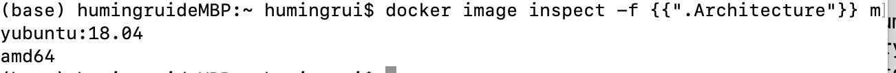
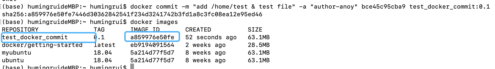
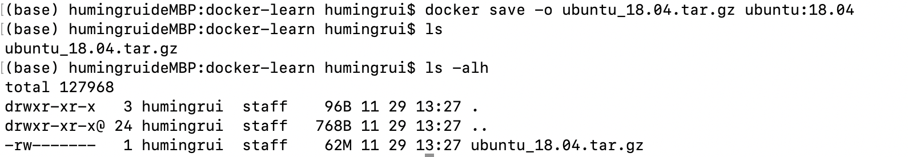
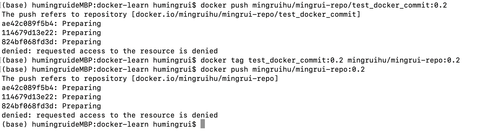
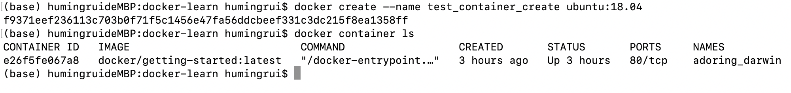
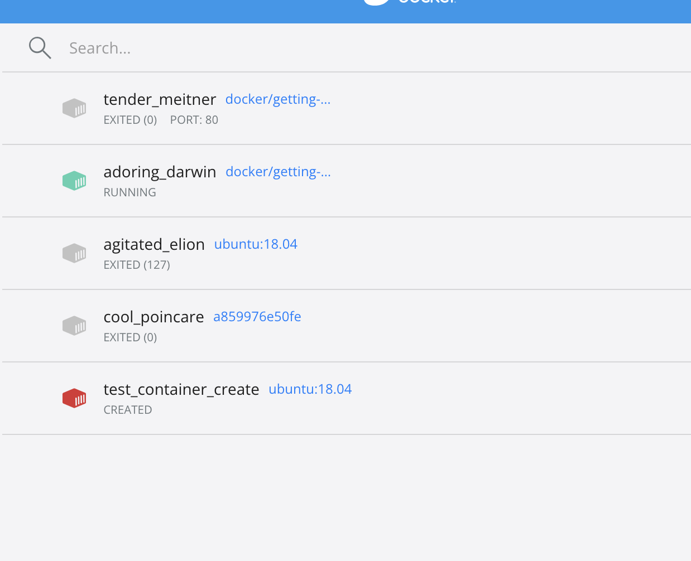
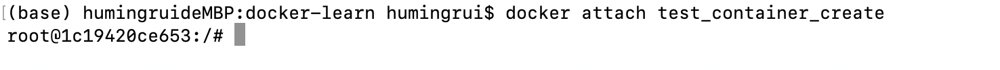

## Chapter1

-   pull

    ```shell
    # docker pull NAME[:TAG]
    
    # NAME: 镜像仓库名称
    # TAG: 镜像标签, 默认latest
    
    docker pull ubuntu:18.04
    
    --registry-mirror=${proxy_url} # https://registry.docker-cn.com
    ```

    

-   run

    ```shell
    docker run -d -p 80:80 --name webserver nginx
    docker run -it ubuntu:18.04 bash
    ```

    -   ​	从浏览器打开80端口

    -   >    -d, --detach             Run container in background and print container ID
        >
        >    -v, --volume list          Bind mount a volume
        >
        >   ​      --volume-driver string      Optional volume driver for the container
        >
        >   ​      --volumes-from list       Mount volumes from the specified container(s)

-   remote repo

    -   ```shell
        # To push a new tag to this repository,
        docker push mingruihu/mingrui-repo:tagname
        ```

-   tag

    ```shell
    # 为本地镜像添加新标签, 但镜像id不变，本地指向同一个镜像文件
    docker tag ubuntu:latest myubuntu:latest
    ```

-   inspect

    ```shell
    docker image inspect [-f {{".Architecture"}}] $image_name
    ```

    

-   search -- 官方镜像

-   删除和清理镜像

    ```shell
    # Image 可以是id 或 tag
    docker rmi $IMAGE  # IMAGE为tag时，多个镜像标签时只会删除特定标签；如果此时只剩一个标签，则删除镜像
    docker image rm [--no-prunes -f]
    # --no-prune 不删除未带标签的父镜像
    
    # 清理遗留历史/临时镜像
    docker prune
    ```

-   创建镜像

    -   基于已有容器创建

        ```shell
        docker run -it $image_name /bin/bash
        # do modification
        > root@$container_id
        e.g. bce45c95cba9, d384463fc905
        # 提交修改
        docker commit -m "message" -a "author" $new_container_id [$repository[:$tag]]
        ```

        

    -   基于本地模版导入

    -   基于docker file

        ```dockerfile
        # dockerfile: example 基于debian-slim 创建python3镜像
        FROM debian:stretch-slim
        
        LABEL version="1.0" maintainer="docker user <email>"
        
        RUN apt-get update &&\
        		apt-get install -y python3 \
        		apt-get clean && \ 
        		rm -rf /var/lib/apt/lists/*
        
        ```

        -   ```
            docker build -t python:3 .
            ```

            

-   save & load images

    ```shell
    docker save -o ubuntu_18.04.tar.gz ubuntu:18.04
    ```

    	

    -   ```shell
        docker load -i ubuntu_18.04.tar.gz
        ```

        

-   上传镜像

    ```shell
    # docker push name:tag registry_host:registry_port name:tag
    
    docker tag test:latest user/test:latest
    docker push user/test:latest # to docker.io/user/test
    ```

    ==!!! Requests Denied==



## Chapter 4: 操作docker 容器

```shell
# 创建容器
docker create -it ubuntu:latest 
# 新创建容器处于停止状态，手动启动
docker start container_name
```





```
docker exec -it 1c19420ce6530e0753b02a416e4aac5224bc39e69506bf4818c1f282c5281b65 /bin/sh
```

```shell
docker container wait $container

# run in bg
docker run -d $container

# 查看容器输出
docker logs

# 暂停容器
docker pause $container_id

# 停止: 首先发送SIGTERM， -t时间后超时发送SIGKILL
docker stop $container_id [-t] 10

docker kill $container_id

# 自动清除所有停止状态的容器
docker prune 
```

-   进入容器

    ```shell
    docker attach $container_name
    ```

    

    