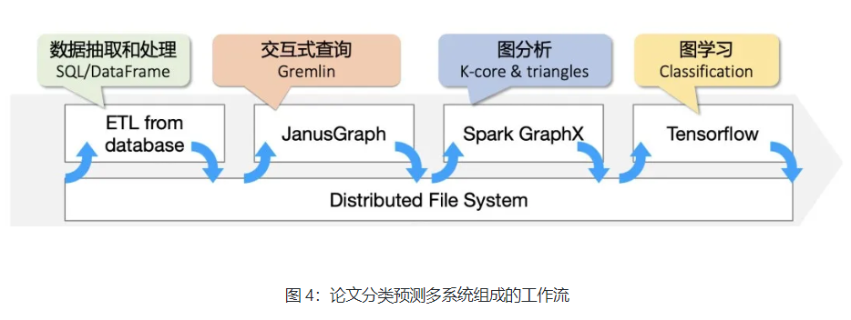
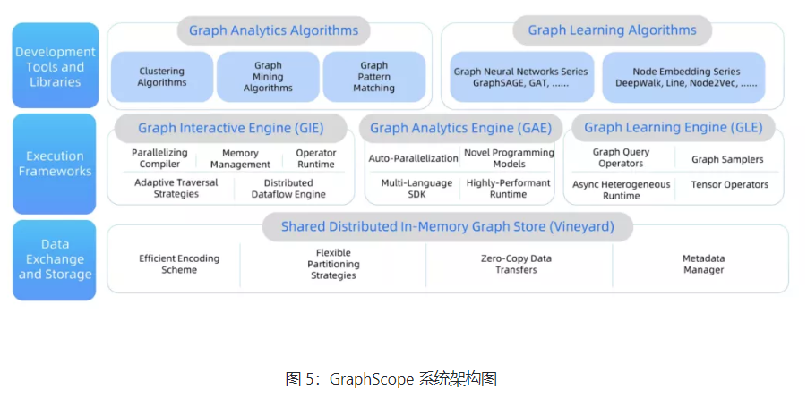
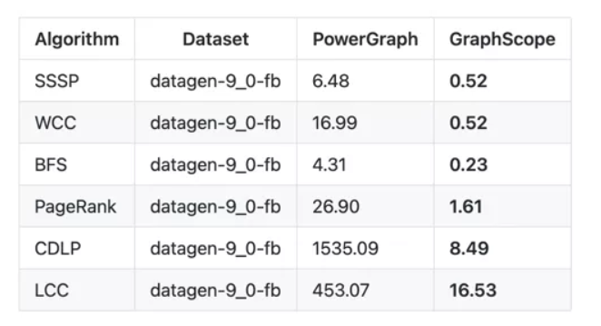

https://developer.aliyun.com/article/780137#slide-4

- 现有工作系统流水线
- 
- 问题： 
- 例如多个系统之间互相独立和割裂，中间数据频繁落盘进行系统间的数据传递；**图分析的程序不是声明性语言，没有固定范式**；图的规模影响机器学习框架的效率等等。这些都是我们在现实图计算场景中常遇到的问题，总结一下可以概括为以下三点：


### GraphScope 架构



- 分布式数据管理系统: 在跨引擎之间，图数据按分区的形式存在于 vineyard，由 vineyard 统一管理
- 引擎层： 交互式查询引擎 GIE，图分析引擎 GAE，和图学习引擎 GLE
- 开发工具和算法库: 
  - GraphScope 提供了各类常用的分析算法，包括连通性计算类、社区发现类和 PageRank、中心度等数值计算类的算法，后续会不断扩展算法包，在超大规模图上提供与 NetworkX 算法库兼容的分析能力。此外也提供了丰富的图学习算法包，内置支持 GraphSage、DeepWalk、LINE、Node2Vec 等算法

### python客户端建立一个 GraphScope 的 session，并载入图数据

- 云原生

- ```python
  import graphscope
  from graphscope.dataset.ogbn_mag import load_ogbn_mag
  
  sess = graphscope.sesson()
  g = load_ogbn_mag(sess, "/testingdata/ogbn_mag/")
  ```

- > 一个 session 的背后对应了一组 k8s 的资源，该session 负责这个会话中所有资源的申请和管理。具体来说，在用户这行代码的背后，session首先会请求一个后端总入口 Coordinator 的 pod。Coordinator 负责跟 Python 客户端的所有通信，在完成自身的初始化后，它会拉起一组引擎 pod。这组 pod 中每一个 pod 都有一个 vineyard 实例，共同组成一个分布式内存管理层；同时，每一个 pod 中都有 GIE、GAE、GLE 三个引擎，它们的启停状态由 Coordinator 在后续按需管理。当这组 pod 拉起并与 Coordinator 建立稳定连接、完成健康检查后，Coordinator 会返回状态到客户端，告诉用户，session 已拉起成功，资源就绪可以开始载图或计算了

### 交互式查询: 

- ```python
  interactive = sess.gremlin(g)
  
  # count the number of papers two authors (with id 2 and 4307) have co-authored
  papers = interactive.execute("g.V().has('author', 'id', 2).out('writes').where(__.in('writes').has('id', 4307)).count()").one()
  ```

- 在图 g 上建立了一个交互式查询对象 interactive, 在引擎 pod 中拉起了一组交互式查询引擎 GIE

- GIE 引擎拆解和执行标准的 Gremlin 查询语句：

  - GIE 引擎由并行化 Compiler、内存和调度管理、Operator 运行时、自适应的游历策略和分布式 Dataflow 引擎等核心组件组成。

  - 游历策略：

    - > 只靠简单的 BFS 或是 DFS 在现实中并不能满足需求。最优的游历策略往往需要根据具体的数据和查询动态调整和选择。GIE 引擎提供了自适应的游历策略配置，根据查询数据、拆解的 Op 和 Cost 模型选择游历策略，以达到算子执行的高效性

### 图分析

- ```python
  # extract a subgraph of publication within a time range
  sub_graph = interactive.subgraph("g.V().has('year', inside(2014, 2020)).outE('cites')")
  
  # project the projected graph to simple graph.
  simple_g = sub_graph.project_to_simple(v_label="paper", e_label="cites")
  
  ret1 = graphscope.k_core(simple_g, k=5)
  ret2 = graphscope.triangles(simple_g)
  
  # add the results as new columns to the citation graph
  sub_graph = sub_graph.add_column(ret1, {"kcore": "r"})
  sub_graph = sub_graph.add_column(ret2, {"tc": "r"})
  ```

- 1. 首先它通过一个 **subgraph 的操作子**从原图中根据筛选条件抽取了一个子图。这个操作子的背后，是交互式引擎 GIE 执行了一个查询，再将结果图写入了 vineyard。
  2. 然后用户在这个新图上抽取了 label 为论文的点和他们之间关系为引用（cites）的边，产出了一张**同构图**
  3. 调用了 GAE 的内置算法 k-core 和三角计数 triangles 在**全图**做了分析型计算
  4. 产出结果后，这两个结果被作为点上的属性加回了原图

- 借助于 vineyard 元数据管理和高层数据抽象，新的 sub_graph 是通过原图上新增一列的变换来生成的，不需要重建整张图的全部数据

### 图分析GAE 

- GAE 引擎核心继承了曾获得 SIGMOD2017 最佳论文奖的 GRAPE 系统[2]
- GAE 也支持用户十分简单的编写自己的算法并在其上即插即用
- 用户以**基于子图编程的 PIE 模型**编写算法，或者重用已有图算法, 而不用考虑分布式细节
  - GAE 支持用户通过C++、Python（后续将支持 Java）等多语言编写自己的算法逻辑，即插即用在分布式环境。

### 图学习引擎 GLE

Demo Task: 图节点分类

- step1: 准备节点特征

- step2: 拉起 GIE中 图 lg 时，

  - 我们配置了图数据，特征属性，指定了哪一类的边，

  - 以及将*点集*划分为了训练集、验证集和测试集。

    ```python
    # define the features for learning
    paper_features = []
    for i in range(128):
        paper_features.append("feat_" + str(i))
    
    paper_features.append("kcore")
    paper_features.append("tc")
    
    # launch a learning engine.
    lg = sess.learning(sub_graph, nodes=[("paper", paper_features)],
                      edges=[("paper", "cites", "paper")],
                      gen_labels=[
                          ("train", "paper", 100, (1, 75)),
                          ("val", "paper", 100, (75, 85)),
                          ("test", "paper", 100, (85, 100))
                      ])
    ```

    

- step3: 选用模型以及做一些训练相关的参数配置

  ```python
  from graphscope.learning.examples import GCN
  from graphscope.learning.graphlearn.python.model.tf.trainer import LocalTFTrainer
  from graphscope.learning.graphlearn.python.model.tf.optimizer import get_tf_optimizer
  
  # supervised GCN.
  
  def train_and_test(config, graph):
      def model_fn():
          return GCN(graph, config["class_num"], ...)
  
      trainer = LocalTFTrainer(model_fn,
                               epoch=config["epoch"]...)
      trainer.train_and_evaluate()
  
  config = {...}
  
  train_and_test(config, lg)
  ```

- GLE 引擎包含 **Graph 与 Tensor** 两部分，分别由各种 Operator 构成。

  - Graph 部分涉及**图数据与深度学习的对接**，如按 Batch 迭代、采样和负采样等，支持同构图和异构图
  - Tensor 部分则由各类深度学习算子构成。在计算模块中，图学习任务被拆解成一个个算子，算子再被运行时分布式的执行。

- 为了进一步**优化采样**性能，GLE 将**缓存**远程邻居、经常访问的点、属性索引等，以加快每个分区中顶点及其属性的查找。

- GLE 采用支持**异构硬件的异步执行引擎**，这使 GLE 可以有效地重叠大量并发操作，例如 I/O、采样和张量计算。GLE 将异构计算硬件抽象为资源池（例如 CPU 线程池和 GPU 流池），并协作调度细粒度的并发任务。

### 性能： LDBC Benchmark 

- 交互式查询测试 LDBC SNB Benchmark
  - 对比： JanusGraph
- 图分析测试  LDBC GraphAnalytics Benchmark 
  - 对比： PowerGraph 
  - 

