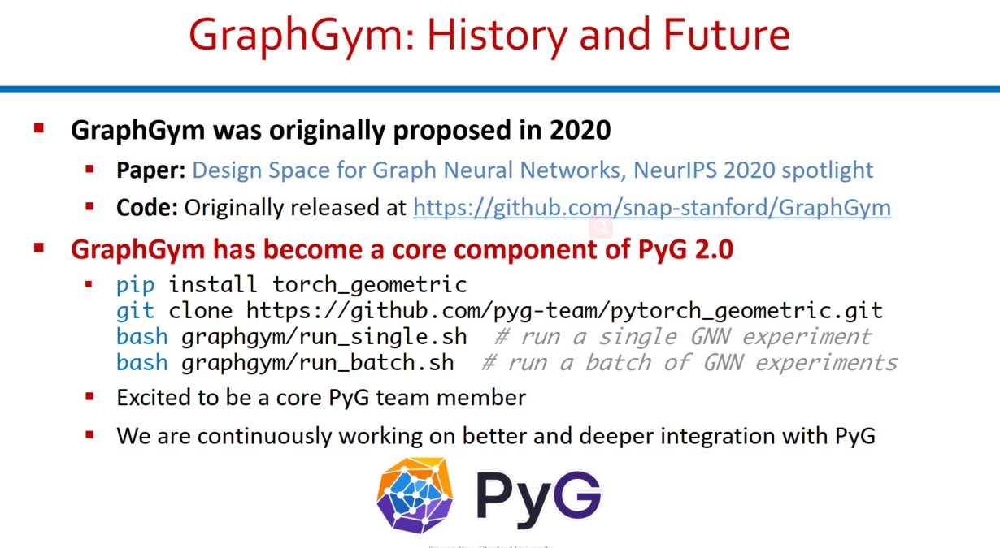
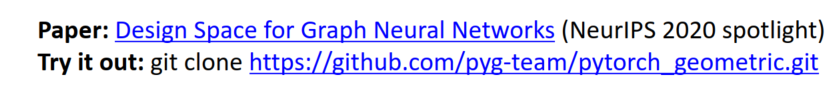

## Key Concept

### 1. Node Embeddings

### 2. GNN

## Challenges

### 1. Implementing a GNN Pipeline

### 2. Find Best GNN Design

- GNN Layer
- Aggregation
- Operator

## GraphGym Solution

### 1. Modularized GNN Pipeline

- Head Dict
- 

### 2. Design Space

- Intra-Layer -> mainly aggregation + tricks
- Inter-Layer -> GNN layer wise connection design
- Learning Configuration

### 3. Configuration file

### 4. Parallelism

### 5. Domain Application in Finance

## Resources

- 

- 

## Open Graph Benchmark ： Large Scale Challenge 2021

### 1. Observations：

- Many novel techniques developed for the OGB-LSC large graphs
  - New **mini-batch sampling** for heterogeneous graphs
  - New **label propagation** methods using GNNs.
  - New **knowledge graph embedding** models 
  - New **self-supervised learning** methods for GNNs
  - **Deeper, bigger, and more expressive GNNs**  
    - 
    - 
    - 
    - 