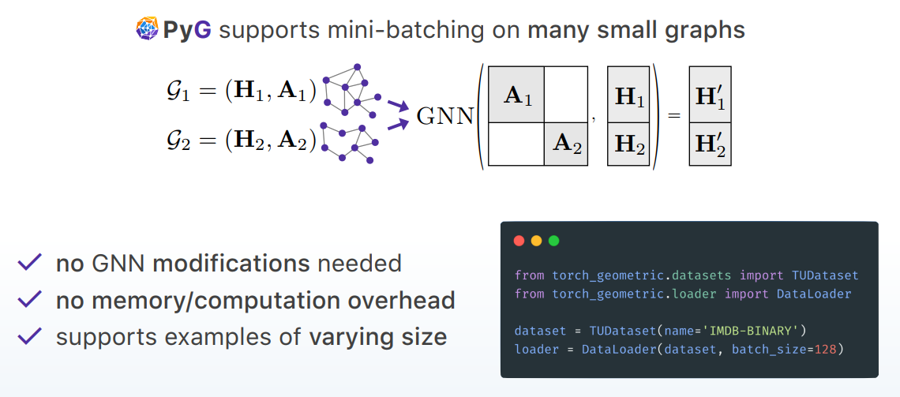

## PyG 2.0 

- Stanford 2021 Graph Workshop

## Message Passing Scheme

### 1. aggregation operator

### 2. message passing interface: 

#### 2.1 `gather` & `scatter_` operator

#### 2.2 edge parallel space

- 

### 2.3 fuse message and aggregation computation  

- for better memory efficiency $\mathit{O}(|V|)$

## 3. SOTA GNN layers

- 

## 4. Mini-Batching in GNNs

### 4.1 small graphs

### 4.2 single giant graph

- `NeighborLoader`

## 5. Standard Graph Learning Tasks

## 6. packages & ecosystem

- 

## 7. PyG 2.0: Advanced Representation Learning on Graphs  

### 7.1 Heterogeneous graph support

### 7.2 challenges

- Heterogeneous graph learning is notoriously challenging
  - **Different input feature distributions** across node and edge **types**
  - Necessity of learning node/edge **type dependent representations**

    - non-shared weights across different node and edge types

    - bipartite message passing
  - **Heterogeneous scalability** approaches

    - Relational-wise neighborhood sampling
  - Complicated implementation

    - requires **sequentially iterating over different** node and edge **types**
    - involves keeping track of different input feature dimensionalities  

### 7.3 Data Storage & Heterogeneous Connection

- `dict` for storing different types of node features
- 
- a full example for **loading raw *.csv files** in the documentation  

### 7.4 Heterogeneous Graph Support

#### 7.4.1 Convert a Homogeneous GNN to Heterogeneous

- learning
 **distinct parameters** for **each individual
 edge type**  

- 

- **Basis decomposition** for regularization

  

#### 7.4.2 conversion of homogeneous GNNs to heterogeneous ones

- `to_hetero(model, (node_types, edge_types))`
- `to_hetero_with_bases(model, (node_types, edge_types))`
- 

#### 7.4.3 Heterogeneous Graph (Relational Neighbor) Samplers  

- **relational neighbor sampling**

- for scaling up to large scale graphs

- 

  #### 7.4.5 Summary of resources

  

### 8. Graph Gym : Design Space Exploration

- Standardized GNN implementation/evaluation  
- GNN architectures in parallelization
- Hyper-parameter search and visualizations  

### 9. Future Plans

#### 9.1 Temporal Graph

#### 9.2 Distributed Data

- While distributed training is possible, distributing data is currently **a user task**
- Scaling to **billions of nodes**
 via distributing input data
- **Partitioning** input node and edge features  

#### 9.3 Auto-Scaling  

- Write GNNs in **full-batch mode** and let PyG
 figure out the rest  
- GNNAutoScale (ICML 2021)  