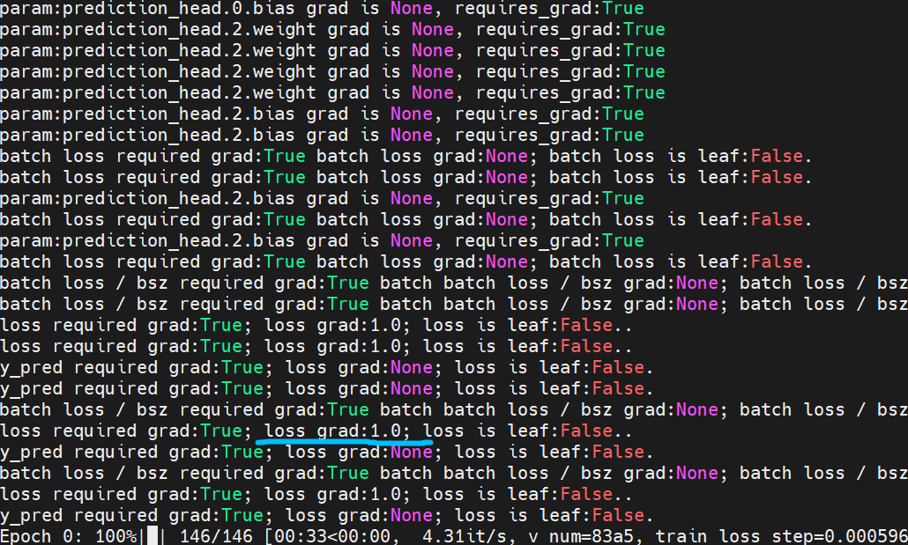
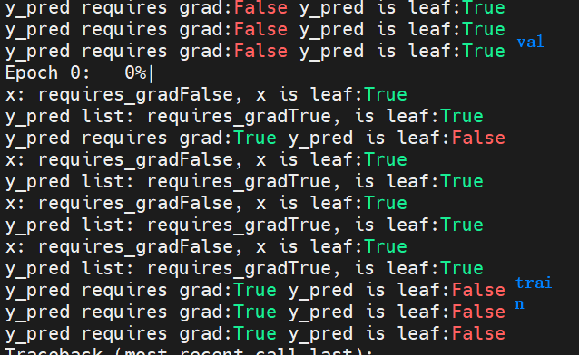

## loss gradient is None




- `nn.Parameter` 获取grad不要用 `param.data.grad`, 会为 None, 直接获取 `param.grad`


- 2022-04-19 

  ```python
  batch_loss = torch.zeros(1).type_as(batch_y)
  batch_loss.retain_grad()
  ```

- 注意， 输入x & y default `requires_grad=False`

  - `type_as` 导致 `batch_loss` `requires_grad` 也是`False`， 从而所有`named_parameters.grad is None`

- related posts

  - 几种会将tensor detached from computational graph的情况

## `requires_grad=True`, `is_leaf` 和 grad populated `grad_fn` 的关系

见 `torch.is_leaf` document

- `tensor.retain_gra()`
  - to attach a `grad_fn` to the tensor 

### Runtime Error: Leaf variable that requires_grad cannot be used in a in-place operation

```shell

File "/home/mingrui/REPO/quant-models/representation_learning/experiments/industry_graph_net.py", line 171, in forward
    y_pred_list[i, :] = y_pred.view(-1)
RuntimeError: a view of a leaf Variable that requires grad is being used in an in-place operation.

```

where, `y_pred_list` is created as 

```python
# results placeholder
y_pred_list = torch.zeros((bsz, n_stocks)).type_as(x).requires_grad_(True)
```


- ```python
  batch_loss += loss
  ```


## RuntimeError: one of the variables needed for gradient computation has been modified by an inplace operation: [torch.cuda.FloatTensor [64, 1]], which is output 0 of AsStridedBackward0, is at version 4; expected version 3 instead. Hint: enable anomaly detection to find the operation that failed to compute its gradient, with torch.autograd.set_detect_anomaly(True).

## references for computational graph & auto_difference


## Q:

### 1. 除了x, y 什么情况下创建的tensor会被判定为leaf nodes

```python
y_pred = self.prediction_head(g_out)
# # 2022-04-19 debug raw output
# print(f"y_pred requires grad:{y_pred.requires_grad} y_pred is "
#       f"leaf:{y_pred.is_leaf}")
y_pred_list[i, :] = y_pred.view(-1)
```



```
# torch.autograd.set_detect_anomaly(True)
```