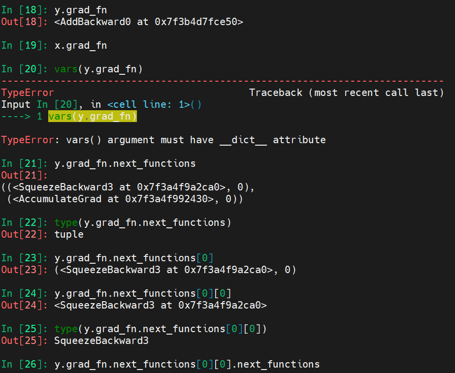

|                        | `.grad`                          | `requires_grad` | `.grad_fn`             | have associated `backward graph` |
| ---------------------- | -------------------------------- | --------------- | ---------------------- | -------------------------------- |
| leaf                   | accumulated during backward path | can be setted   |                        |                                  |
| non-leaf               |                                  | `True`          | do not have `.grad_fn` |                                  |
| nn.Parameter(non-leaf) |                                  | `True`          |                        |                                  |

- record in backward graph 与 `.grad_fn` 与 gradients accumulation(`.grad`) 的关系？
- `[Tensor/nn.Module].requires_grad(False)` to freee model parameters that do not wanted to be updated

- `grad_fn` will be filled during forward pass

## `non-leaf` nodes & `.grad` & `.retain_grad`

- warning:

  ```shell
  UserWarning: The .grad attribute of a Tensor that is not a leaf Tensor is being accessed. Its .grad attribute won't be populated during autograd.backward(). If you indeed want the .grad field to be populated for a non-leaf Tensor, use .retain_grad() on the non-leaf Tensor. If you access the non-leaf Tensor by mistake, make sure you access the leaf Tensor instead. See github.com/pytorch/pytorch/pull/30531 for more informations. (Triggered internally at  /opt/conda/conda-bld/pytorch_1634272068694/work/build/aten/src/ATen/core/TensorBody.h:417.)
    return self._grad
  ```

   

## Jacobain 

https://machinelearningmastery.com/a-gentle-introduction-to-the-jacobian/


## generating/loop thourgh the computation graph




## references

- https://sidsite.com/posts/autodiff/
  - include a sample implementation of a auto difference framework
- [Example implementation of reverse-mode autodiff](https://colab.research.google.com/drive/1VpeE6UvEPRz9HmsHh1KS0XxXjYu533EC)
- [In-place operations & Multithreaded Autograd](https://pytorch.org/docs/stable/notes/autograd.html)
- https://pytorch.org/tutorials/beginner/blitz/autograd_tutorial.html
  - vector backward call