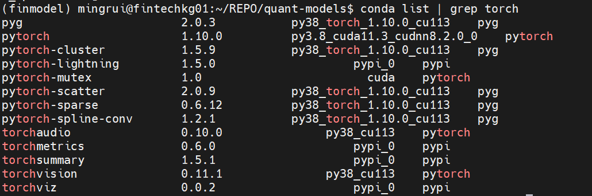

## RuntimeError: DataLoader worker (pid 4068913) is killed by signal: Killed.

https://github.com/pytorch/pytorch/issues/8976


我的原因:  `dmesg -T` --> killed worker OOM


## Pytorch Cannot Open Share Memory Object or OS Error： too much file open

- 1. torch version

     

  2. check share memory limit

     ```shell
     ipcs -lm
     ```

     

  3. check system open file limit

     ```shell
     ulimit -n[a]
     ```

     - 1024 

  4. raise open file limit 

     - 只在当前shell 生效

       ```
       ulimit -SHn 51200
       ```

- 遗留问题：

  - 在之前一个数据集上同样的代码 open file limit 1024没有问题， 但在另一个数据集上当dataloader num_workers 设为 > 0 就会出现这样的问题

  - 相关问题links

    - 查看share memoryhttps://www.bo-yang.net/2010/12/31/linux-shared-memory
    - https://blog.csdn.net/qq_17732497/article/details/106637672
    - https://github.com/pytorch/pytorch/issues/73644
    - https://github.com/facebookresearch/maskrcnn-benchmark/issues/103
    - https://github.com/pytorch/pytorch/issues/1355

    