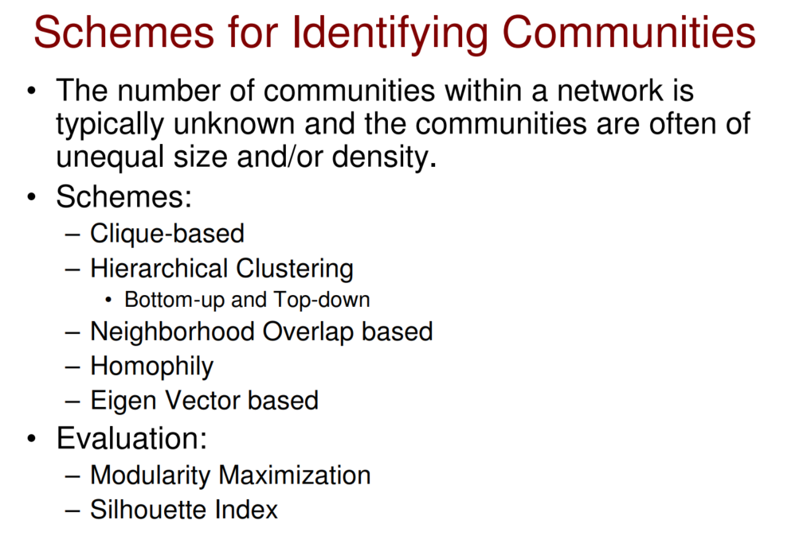
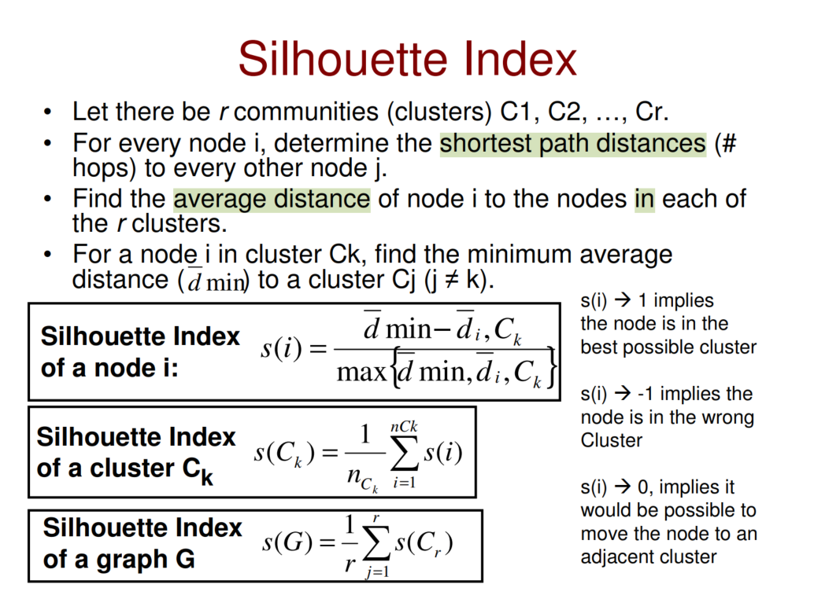

社区检测算法（例如，最大团/clique、联通量计算、Louvain 和标签传播）

### 1. networkx

https://networkx.org/documentation/stable/reference/algorithms/community.html

### 2. https://towardsdatascience.com/community-detection-algorithms-9bd8951e7dae

- merge

  1. Louvain Community Detection

  2. Suprise Community Detection

  3. Leiden Community Detection

     [4] V. A. Traag, L. Waltman, and N. J. van Eck, “From Louvain to Leiden: guaranteeing well-connected communities,” Sci. Rep., vol. 9, no. 1, pp. 1–12, 2019, doi: 10.1038/s41598–019–41695-z.

  4. Walktrap

     [5] Pons, P. and Latapy, M., n.d. Computing communities in large networks using random walks.

- k-clique communities
  - "Uncovering the overlapping community structure of complex networks in nature and society" - G. Palla, I. Derényi, I. Farkas, and T. Vicsek - Nature 435, 814–818 (2005)
  - http://people.seas.harvard.edu/~babis/kcliqueDSP.pdf
  - https://networkx.org/documentation/stable/_modules/networkx/algorithms/community/kclique.html#k_clique_communities

### 3. https://en.wikipedia.org/wiki/Community_structure

- Internal Density &  External Density
  $$ { }
  \delta_{int} = \frac{\sum_ik_i^{int}}{n_c(n_c - 1)} \\
  \delta_{ext} = \frac{\sum_ik_i^{ext}}{2n_c(n_c - 1)}
  $$

  - For every node $i$ in $C$, let $k_i^{int}$ and $k_i^{ext}$ be the $\#links$ connecting node $i$ to
    a node in C and outside C respectively  
  - ==Q: why 2 in the delimiter of $\delta_{ext}$==

- 

- Clique-Based
  - me comment: communities depend on edge connections only, no node attribution considered, requires a thorough **edge defination**.
  - clique & independent set
    - https://en.wikipedia.org/wiki/Independent_set_(graph_theory)#:~:text=In%20graph%20theory%2C%20an%20independent,
  - Heurisitc minimal neighbors independent set
    - pruned method： find k-clieque
  - Clique percolation method : overlapping communites

- Hierarchical Clustering

  - Agglomative(bottom up) - Complete Linkge
    - Non-overlapping
  - Divisional(top-down) - Edge Betweeness
    - **girvan_newman**

- Neighborhood overlap based

  - granularity - edge
  - **triadic closure** properties

  - Edge and Node Embeddedness
    - Structural Hole

- Homophily

  - Removing all **the cross-community links** would lead us to identify the nodes forming the different communities  

- EigenVectors

## Evalutation

#### 1. **Modularity Maximization**

- Given a network with m edges, the expected number of edges between two nodes $i$ and $j$ with degrees $d_i$ and $d_j$ respectively is $d_i*d_j / 2m$  

- **Modularity** （Undirected）

  - For a network with $k$ communities and a total of $m$ edges  

  $$
  Q = \sum_{l=1}^k\sum_{i \in C_l, j\in C_l} A_{i,j} - \frac{d_id_j}{2m}
  $$

  - A larger value for Q indicates a good community structure  

#### 2. Sihouette Index

### 4. https://en.wikipedia.org/wiki/Community_structure#Properties

