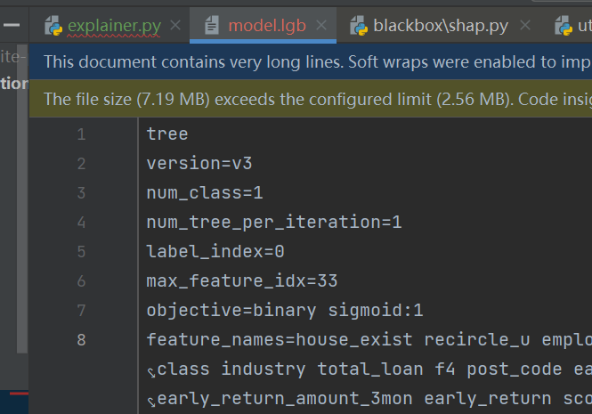

1. `boosting.h`  line 165 中定义虚函数 (PS: 类似 python中子类override父类abstract method的概念)

   ```c++
   /*!
   * \brief Feature contributions for the model's prediction of one record
   * \param feature_values Feature value on this record
   * \param output Prediction result for this record
   */
   virtual void PredictContrib(const double* features, double* output) const = 0;
   
   virtual void PredictContribByMap(const std::unordered_map<int, double>& features,
                                    std::vector<std::unordered_map<int, double>>* output) const = 0;
   ```
   
1. `gbdt.cpp`

   ```c++
   void GBDT::PredictContrib(const double* features, double* output) const {
     // set zero
     const int num_features = max_feature_idx_ + 1;
     std::memset(output, 0, sizeof(double) * num_tree_per_iteration_ * (num_features + 1));
     const int end_iteration_for_pred = start_iteration_for_pred_ + num_iteration_for_pred_;
     for (int i = start_iteration_for_pred_; i < end_iteration_for_pred; ++i) {
       // predict all the trees for one iteration
       for (int k = 0; k < num_tree_per_iteration_; ++k) {
         models_[i * num_tree_per_iteration_ + k]->PredictContrib(features, num_features, output + k*(num_features + 1));
       }
     }
   }
   ```

   - loop through  ` (int i = start_iteration_for_pred_; i < end_iteration_for_pred; ++i)` * `num_tree_per_iteration_` 

   - `models_` :  `gbdt.h line 485`

     ```c++
       /*! \brief Trained models(trees) */
       std::vector<std::unique_ptr<Tree>> models_;
     ```

     

2. `tree.h`

   ```c++
   inline void Tree::PredictContrib(const double* feature_values, int num_features, double* output) {
     output[num_features] += ExpectedValue();
     // Run the recursion with preallocated space for the unique path data
     if (num_leaves_ > 1) {
       CHECK_GE(max_depth_, 0);
       const int max_path_len = max_depth_ + 1;
       std::vector<PathElement> unique_path_data(max_path_len*(max_path_len + 1) / 2);
       TreeSHAP(feature_values, output, 0, 0, unique_path_data.data(), 1, 1, -1);
     }
   }

3. `tree.cpp` line 1027 `Tree::ExpectedValue()` (注意： 这是单个树的)

   ```c++
   double Tree::ExpectedValue() const {
     if (num_leaves_ == 1) return LeafOutput(0);
     const double total_count = internal_count_[0];
     double exp_value = 0.0;
     for (int i = 0; i < num_leaves(); ++i) {
       exp_value += (leaf_count_[i] / total_count)*LeafOutput(i);
     }
     return exp_value;
   }
   ```

   - 1中GBDT的`output` 大小`std::memset(output, 0, sizeof(double) * num_tree_per_iteration_ * (num_features + 1))` 
     - also,  `gbdt.cpp` line 616 `output + k*(num_features + 1)`
   - 2中 `output[num_features] += ExpectedValue();` 
     - 注意这里的`output` 是 全局output + 偏移量(树个数*特征个数): `output + k*(num_features + 1)`
     - 即每个iteration中的(==每个树每个特征？==)expected value 直接相加(从最终输出看所有特征的expected value是一样的)
       - 见lgb模型文件，事实上对于gbdt， 每次boosting就是一次iteration， 每次iteration就是1棵树 --> `num_trees=588` & `num_iterations=588` & `num_tree_per_iteration_=1` 

   - 3中每个树的`ExpectedValue`是每个树的所有叶子节点输出的加权平均

   - 问题：所有的树的expected value怎么平均?


## 调用：

0. in `c_api.cpp` `SingleRowPredictor` `Constructor`:

   ```c++
   // Single row predictor to abstract away caching logic
   class SingleRowPredictor {
    public:
     PredictFunction predict_function;
     int64_t num_pred_in_one_row;
   
     SingleRowPredictor(int predict_type, Boosting* boosting, const Config& config, int start_iter, int num_iter) {
       bool is_predict_leaf = false;
       bool is_raw_score = false;
       bool predict_contrib = false;
       if (predict_type == C_API_PREDICT_LEAF_INDEX) {
         is_predict_leaf = true;
       } else if (predict_type == C_API_PREDICT_RAW_SCORE) {
         is_raw_score = true;
       } else if (predict_type == C_API_PREDICT_CONTRIB) {
         predict_contrib = true;
       }
       early_stop_ = config.pred_early_stop;
       early_stop_freq_ = config.pred_early_stop_freq;
       early_stop_margin_ = config.pred_early_stop_margin;
       iter_ = num_iter;
       predictor_.reset(new Predictor(boosting, start_iter, iter_, is_raw_score, is_predict_leaf, predict_contrib,
                                      early_stop_, early_stop_freq_, early_stop_margin_));
       num_pred_in_one_row = boosting->NumPredictOneRow(start_iter, iter_, is_predict_leaf, predict_contrib);
       predict_function = predictor_->GetPredictFunction();
       num_total_model_ = boosting->NumberOfTotalModel();
     }
   
   ```

   使用了下面`predictor.hpp` `Predictor` 中定义的一个inline getter

1.  `class Booster`:

   ```c++
     void PredictSingleRow(int predict_type, int ncol,
                  std::function<std::vector<std::pair<int, double>>(int row_idx)> get_row_fun,
                  const Config& config,
                  double* out_result, int64_t* out_len) const {
       if (!config.predict_disable_shape_check && ncol != boosting_->MaxFeatureIdx() + 1) {
         Log::Fatal("The number of features in data (%d) is not the same as it was in training data (%d).\n"\
                    "You can set ``predict_disable_shape_check=true`` to discard this error, but please be aware what you are doing.", ncol, boosting_->MaxFeatureIdx() + 1);
       }
       UNIQUE_LOCK(mutex_)
       const auto& single_row_predictor = single_row_predictor_[predict_type];
       auto one_row = get_row_fun(0);
       auto pred_wrt_ptr = out_result;
       single_row_predictor->predict_function(one_row, pred_wrt_ptr);
   
       *out_len = single_row_predictor->num_pred_in_one_row;
     }
   ```

   

2. `src\application\predictor.hpp` 中的constructor line 97 (PS: 不确定c++中是不是叫constructor, 反正就是那个位置)

- 定义了不同预测模式（predict_leaf_index, predict_contrib, predict_raw_score, predict）下的lambda函数: predict_func_ 及 predict_sparse_fun_ 

  https://www.cnblogs.com/DswCnblog/p/5629165.html

```c++
/*!
* \brief Used to predict data with input model
*/
class Predictor {
 public:
  /*!
  * \brief Constructor
  * \param boosting Input boosting model
  * \param start_iteration Start index of the iteration to predict
  * \param num_iteration Number of boosting round
  * \param is_raw_score True if need to predict result with raw score
  * \param predict_leaf_index True to output leaf index instead of prediction score
  * \param predict_contrib True to output feature contributions instead of prediction score
  */
  Predictor(Boosting* boosting, int start_iteration, int num_iteration, bool is_raw_score,
            bool predict_leaf_index, bool predict_contrib, bool early_stop,
            int early_stop_freq, double early_stop_margin) {
    early_stop_ = CreatePredictionEarlyStopInstance(
        "none", LightGBM::PredictionEarlyStopConfig());
    if (early_stop && !boosting->NeedAccuratePrediction()) {
      PredictionEarlyStopConfig pred_early_stop_config;
      CHECK_GT(early_stop_freq, 0);
      CHECK_GE(early_stop_margin, 0);
      pred_early_stop_config.margin_threshold = early_stop_margin;
      pred_early_stop_config.round_period = early_stop_freq;
      if (boosting->NumberOfClasses() == 1) {
        early_stop_ =
            CreatePredictionEarlyStopInstance("binary", pred_early_stop_config);
      } else {
        early_stop_ = CreatePredictionEarlyStopInstance("multiclass",
                                                        pred_early_stop_config);
      }
    }

    boosting->InitPredict(start_iteration, num_iteration, predict_contrib);
    boosting_ = boosting;
    num_pred_one_row_ = boosting_->NumPredictOneRow(start_iteration,
        num_iteration, predict_leaf_index, predict_contrib);
    num_feature_ = boosting_->MaxFeatureIdx() + 1;
    predict_buf_.resize(
        OMP_NUM_THREADS(),
        std::vector<double, Common::AlignmentAllocator<double, kAlignedSize>>(
            num_feature_, 0.0f));
    const int kFeatureThreshold = 100000;
    const size_t KSparseThreshold = static_cast<size_t>(0.01 * num_feature_);
    if (predict_leaf_index) {
      predict_fun_ = [=](const std::vector<std::pair<int, double>>& features,
                         double* output) {
        int tid = omp_get_thread_num();
        if (num_feature_ > kFeatureThreshold &&
            features.size() < KSparseThreshold) {
          auto buf = CopyToPredictMap(features);
          boosting_->PredictLeafIndexByMap(buf, output);
        } else {
          CopyToPredictBuffer(predict_buf_[tid].data(), features);
          // get result for leaf index
          boosting_->PredictLeafIndex(predict_buf_[tid].data(), output);
          ClearPredictBuffer(predict_buf_[tid].data(), predict_buf_[tid].size(),
                             features);
        }
      };
    } else if (predict_contrib) {
      if (boosting_->IsLinear()) {
        Log::Fatal("Predicting SHAP feature contributions is not implemented for linear trees.");
      }
      predict_fun_ = [=](const std::vector<std::pair<int, double>>& features,
                         double* output) {
        int tid = omp_get_thread_num();
        CopyToPredictBuffer(predict_buf_[tid].data(), features);
        // get feature importances
        boosting_->PredictContrib(predict_buf_[tid].data(), output);
        ClearPredictBuffer(predict_buf_[tid].data(), predict_buf_[tid].size(),
                           features);
      };
      predict_sparse_fun_ = [=](const std::vector<std::pair<int, double>>& features,
                                std::vector<std::unordered_map<int, double>>* output) {
        auto buf = CopyToPredictMap(features);
        // get sparse feature importances
        boosting_->PredictContribByMap(buf, output);
      };

    } else {
      if (is_raw_score) {
        predict_fun_ = [=](const std::vector<std::pair<int, double>>& features,
                           double* output) {
          int tid = omp_get_thread_num();
          if (num_feature_ > kFeatureThreshold &&
              features.size() < KSparseThreshold) {
            auto buf = CopyToPredictMap(features);
            boosting_->PredictRawByMap(buf, output, &early_stop_);
          } else {
            CopyToPredictBuffer(predict_buf_[tid].data(), features);
            boosting_->PredictRaw(predict_buf_[tid].data(), output,
                                  &early_stop_);
            ClearPredictBuffer(predict_buf_[tid].data(),
                               predict_buf_[tid].size(), features);
          }
        };
      } else {
        predict_fun_ = [=](const std::vector<std::pair<int, double>>& features,
                           double* output) {
          int tid = omp_get_thread_num();
          if (num_feature_ > kFeatureThreshold &&
              features.size() < KSparseThreshold) {
            auto buf = CopyToPredictMap(features);
            boosting_->PredictByMap(buf, output, &early_stop_);
          } else {
            CopyToPredictBuffer(predict_buf_[tid].data(), features);
            boosting_->Predict(predict_buf_[tid].data(), output, &early_stop_);
            ClearPredictBuffer(predict_buf_[tid].data(),
                               predict_buf_[tid].size(), features);
          }
        };
      }
    }
  }
  /*!
  * \brief Destructor
  */
  ~Predictor() {
  }

  inline const PredictFunction& GetPredictFunction() const {
    return predict_fun_;
  }


  inline const PredictSparseFunction& GetPredictSparseFunction() const {
    return predict_sparse_fun_;
  }
```

### lgb 模型文件

- ```
  num_class=1
  num_tree_per_iteration=1
  label_index=0
  max_feature_idx=33
  objective=binary sigmoid:1
  
  parameters:
  [boosting: gbdt]
  [objective: binary]
  [metric: binary_logloss]
  [tree_learner: serial]
  [device_type: cpu]
  [linear_tree: 0]
  [data: ]
  [valid: ]
  [num_iterations: 588]
  [learning_rate: 0.0455568]
  [num_leaves: 91]
  [num_threads: -1]
  [deterministic: 0]
  [force_col_wise: 0]
  [force_row_wise: 0]
  [histogram_pool_size: -1]
  [max_depth: 22]
  [min_data_in_leaf: 112]
  [min_sum_hessian_in_leaf: 0.001]
  [bagging_fraction: 0.849598]
  [pos_bagging_fraction: 1]
  [neg_bagging_fraction: 1]
  [bagging_freq: 0]
  [bagging_seed: 3]
  [feature_fraction: 0.887283]
  [feature_fraction_bynode: 1]
  [feature_fraction_seed: 2]
  [extra_trees: 0]
  [extra_seed: 6]
  [early_stopping_round: 0]
  [first_metric_only: 0]
  [max_delta_step: 0]
  [lambda_l1: 0]
  [lambda_l2: 0]
  [linear_lambda: 0]
  [min_gain_to_split: 0]
  [drop_rate: 0.1]
  [max_drop: 50]
  [skip_drop: 0.5]
  [xgboost_dart_mode: 0]
  [uniform_drop: 0]
  [drop_seed: 4]
  [top_rate: 0.2]
  [other_rate: 0.1]
  [min_data_per_group: 100]
  [max_cat_threshold: 32]
  [cat_l2: 10]
  [cat_smooth: 10]
  [max_cat_to_onehot: 4]
  [top_k: 20]
  [monotone_constraints: ]
  [monotone_constraints_method: basic]
  [monotone_penalty: 0]
  [feature_contri: ]
  [forcedsplits_filename: ]
  [refit_decay_rate: 0.9]
  [cegb_tradeoff: 1]
  [cegb_penalty_split: 0]
  [cegb_penalty_feature_lazy: ]
  [cegb_penalty_feature_coupled: ]
  [path_smooth: 0]
  [interaction_constraints: ]
  [verbosity: -1]
  [saved_feature_importance_type: 0]
  [max_bin: 255]
  [max_bin_by_feature: ]
  [min_data_in_bin: 3]
  [bin_construct_sample_cnt: 200000]
  [data_random_seed: 1]
  [is_enable_sparse: 1]
  [enable_bundle: 1]
  [use_missing: 1]
  [zero_as_missing: 0]
  [feature_pre_filter: 1]
  [pre_partition: 0]
  [two_round: 0]
  [header: 0]
  [label_column: ]
  [weight_column: ]
  [group_column: ]
  [ignore_column: ]
  [categorical_feature: name:year_of_loan,class,subclass,work_type,employer_type,industry_type,work_year,house_loan_status,censor_status,marriage,offspring,use,postcode,region,title,policy_code]
  [forcedbins_filename: ]
  [objective_seed: 5]
  [num_class: 1]
  [is_unbalance: 0]
  [scale_pos_weight: 1]
  [sigmoid: 1]
  [boost_from_average: 1]
  [reg_sqrt: 0]
  [alpha: 0.9]
  [fair_c: 1]
  [poisson_max_delta_step: 0.7]
  [tweedie_variance_power: 1.5]
  [lambdarank_truncation_level: 30]
  [lambdarank_norm: 1]
  [label_gain: ]
  [eval_at: ]
  [multi_error_top_k: 1]
  [auc_mu_weights: ]
  [num_machines: 1]
  [local_listen_port: 12400]
  [time_out: 120]
  [machine_list_filename: ]
  [machines: ]
  [gpu_platform_id: -1]
  [gpu_device_id: -1]
  [gpu_use_dp: 0]
  [num_gpu: 1]
  
  end of parameters
  ```



### lgb

- all trees get same number of leaves ? how & why?

- Predict & PredictRaw()

  - whether to apply sigmoid function

  ```c++
  void GBDT::Predict(const double* features, double* output, const PredictionEarlyStopInstance* early_stop) const {
    PredictRaw(features, output, early_stop);
    if (average_output_) {
      for (int k = 0; k < num_tree_per_iteration_; ++k) {
        output[k] /= num_iteration_for_pred_;
      }
    }
    if (objective_function_ != nullptr) {
      objective_function_->ConvertOutput(output, output);
    }
  }
  ```

  - 注意 参数 `average_output_`

- `arc\objective\binary_objective.hpp` -> `BinaryLogLoss::ConvertOuput`  -> where sigmoid function is applied

  ```c++
    void ConvertOutput(const double* input, double* output) const override {
      output[0] = 1.0f / (1.0f + std::exp(-sigmoid_ * input[0]));
    }
  ```

- ==Q: 所以Tree::leaf_value_中的raw score到底是个什么含义？绝对值可以>1, 但是实际上的输入标签只可能在0-1之间==

  - -> `PredictRaw` -> `Decision` -> 获得的是什么(leaf index? leaf value?)

  - 所有树的结果如何融合成1个值？ -> GBDT 应该是sum()?

    
