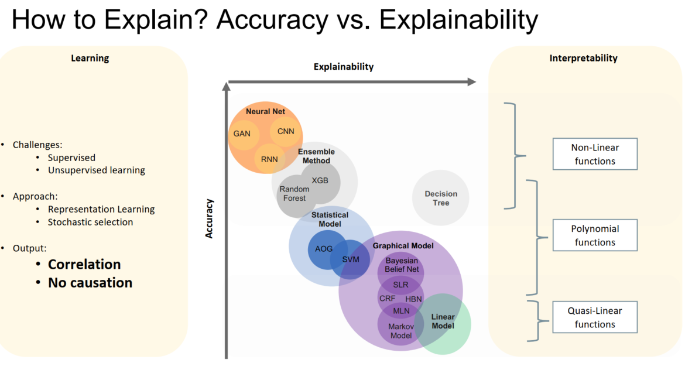

## Introduction

### Examples of an End2End XAI System

- example questions：
  - **why?** - for a test instance
  - **contrastive examples** - which training examples are most **influential** to the prediction?
  - **what if & why?** - do some permutations on input features?

### Evaluation

#### 1. Perturbation-based methods

- Perturb top-k features by attribution and observe change in prediction
- Area over perturbation curve
- comment: 注意这个feature attribution methods 中的permutation features不同，这个使用来evaluation的，可以用于任何feature attribution 方法

#### 2. Human（Role）-based evaluation

- p41

#### 3. One objective, Many Metrics

- Comprehensibility
- Succinctness
  - How concise and compact is the explanation
- Accuracy
  - How accurate and precise is the explanation
- Actionability
  - what can one action/do with the explanation
- Reusability
  - Could the explanation be personalized
- Completeness
  - Is the explanation complete, partial or restricted

#### 4. One objective, Many 'AI's, Many Definitions, Many Approaches

​	p55

- Uncertainty Map
  - UAI - uncertainty as an alternative to explanation
- Combination of multi-model decisions

### Overview of Explanation in Machine Learning

#### 2021趋势 in NIPS

#### 1. ANN p57

##### 1.1 Attribution for Deep Network - Integrated gradient-based

- Integrated Gradients

- Deep  Lift
- LRP

##### 1.2 Prototype/Auto-encoder

- AAAI 2018

##### 1.3 Attention Mechanism

- RETAIN NIPS 2016

##### 1.4 Surrogate Model

##### 1.5 ==Explaining Uncertainty== - Beyond Interpretation of Prediction  

- Getting a clue: a method for explaining uncertainty estimates. ICLR 2021

- Error Uncertainty in Explanation for Stability & Credibility  
  - Reliable Post hoc Explanations: Modeling Uncertainty in Explainability. NeurIPS 2021  

##### 1.6 More ==semantic== interpretation

- **ConceptSHAP**: On Completeness-aware Concept Based Explanations in Deep Neural Networks. NeurIPS 2020  
- Towards Automatic Concept-based Explanations. NeurIPS 2019 
- **Compositional Explanations** of Neurons. NeurIPS 2020 

##### 1.7 minimal sufficient explanation (with beam search)

- Getting a clue: a method for explaining uncertainty estimates. ICLR 2021

#### 2. CV

- Interpretable Units
- Uncertainty Map
  - NIPS 2017
  - NIPS 2021
- Visual Explanation
- Saliency Map

#### 3. Graph

- GNNExplainer  :  
  - Ying, Z., Bourgeois, D., You, J., Zitnik, M., & Leskovec, J. (2019).
    Gnnexplainer: Generating explanations for graph neural
    networks. Advances in neural information processing systems, 32  
- Counterfactual Graph Explanation
  - Mohit Bajaj , Lingyang Chu, Zi Yu Xue, Jian Pei, Lanjun Wang,
    Peter Cho-Ho Lam, Yong Zhang. Robust Counterfactual
    Explanations on Graph Neural Networks. NeurIPS 2021  
- SubgraphX
  - Yuan, H., Yu, H., Wang, J., Li, K., & Ji, S. (2021, July).   On explainability of graph neural networks via subgraph explorations. In International Conference on Machine Learning (pp. 12241-
    12252). PMLR.  

- PGMExplainer ：
  - Vu, M., & Thai, M. T. (2020). Pgm-explainer: Probabilistic graphical
    model explanations for graph neural networks. Advances in neural
    information processing systems, 33, 12225-12235  
- PGExplainer  ：
  - Luo, D., Cheng, W., Xu, D., Yu, W., Zong, B., Chen, H., &
    Zhang, X. (2020). Parameterized explainer for graph neural
    network. Advances in neural information processing
    systems, 33, 19620-19631  

### Overview of Explanation in different AI Fields

#### 1. Game Theory

- Shapley additive Explanation
- L-shapley and C-shapley - ICLR 2019
- instance-wise feature importance - causal influence

#### 2. Search and Constraint Satisfaction

- p62

#### 3. Knowledge Representation and Reasoning

- In Bayesian Network - Adductive Reasoning

- Diagnoses Inference - discrete event system

#### 4. Multi-agent system

#### 5. NLP

- ==Towards Explainable NLP: A Generative Explanation Framework for Text Classification. CoRR2018==
- LIME for NLP

#### 6. Planing and Scheduling

#### 7. Robotics

#### 8. Reasoning under Uncertainty

- Probabilistic Graphic Model

## Explainable ML from a Machine Learning Perspective

### Interpretability cheat-sheet

- 

### 1. Feature Attribution

#### 1.1 Ablation

#### 1.2 Gradient-based methods - differentiable models

- Feature * Gradient

- $$
  x_i * \frac{\partial{y}}{\partial{x_i}}
  $$

- First order Taylor Approximation

- analogy to linear model $x_i * w_i$, where $w_i = \frac{\partial{y}}{\partial{x_i}}$

- cons: -> gradients in the local area too noisy

#### 1.4 Score  Back-propagation based methods - NN only

- p91

- Guided BackProp
- Deep Lift
- LRP: linearize non-linear activation function
- Pros:
  - Conceptually simple
  - Methods have been empirically validated to
    yield sensible result
- Cons:
  - Hard to implement, requires instrumenting
    the model
  - ==? ? Often breaks implementation invariance==
    Think: F(x, y, z) = x * y *z and G(x, y, z) = x * (y * z)  

#### 1.5 Shapley Value

- p104

- resources:
  - [The Explanation Game: Explaining Machine Learning Models with Cooperative Game
    Theory](https://arxiv.org/abs/1909.08128)  
  - "Computational Aspects of Cooperative Game Theory”, Chalkiadakis et al. 2011  

##### 1.5.1 **==Non-atomic Games：Aumann-Shapley Values and IG==**  

- p112	

#### 1.6 Cons of attribution

- Some things that are missing:
  - **Feature interactions** (ignored or averaged out)
  -  **What training examples influenced** the prediction (training agnostic)
  - Global properties of the model (prediction-specific)  

### 2. ==Other Local Explanation Methods==

- p118

- Local Interpretable Model-agnostic Explanation KDD2016
- Anchors AAAI2018
- **==Influence Functions==** ICML2017
  - how does it differ from “Score BackProp”？
- ==Example based Explanations==  NIPS 2016
  - Prototypes & Criticisms

### Explainable Machine Learning (from a Knowledge Graph Perspective)  

- Freddy Lécué: On the role of knowledge graphs in explainable AI. Semantic Web 11(1): 41-51 (2020)  
- How to ==explain transfer learning== with appropriate knowledge representation?
- KG provides **contexts** for XAI methods mentioned above
- 

## Industry Cases

### Finance

- Counterfactual - NIPS 2018 workshop
  - Interpretable Credit Application Predictions With Counterfactual Explanations

#### Fiddler

## References

1. Exemplary Natural Images Explain CNN activations better than feature visualizations. ICLR 2021
2. Evaluating Explainable AI: which Algorithmic Explanations Help Users Predict Model Behaviors? ACL 2020
3. Getting a clue: a method for explaining uncertainty estimates. ICLR 2021
4. Concept SHAP
5. Knowledge graph embeddings for dealing with concept drift in machine learning  
6. How Can I Explain This to You? An Empirical Study of Deep Neural Network Explanation Methods. NeurIPS 2020  
7. Reliable Post hoc Explanations: Modeling Uncertainty in Explainability. NeurIPS 2021  
