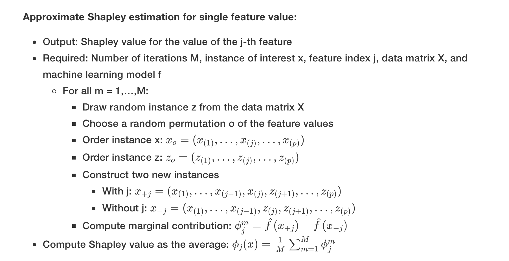
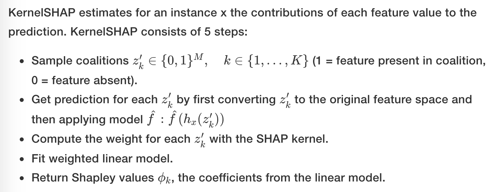

# Shapley value

### View of a game

-   The feature values of a data instance act as players in a coalition
-   Shapley values tell us how to fairly distribute the “payout” (= the prediction) among players (the features)
-   Define **==Players==**:
    -   A player can be **an individual feature value**, e.g. for tabular data. 
    -   A player can also be a group of feature values. 
        -   For example to explain an image, pixels can be grouped to ***super pixels*** and *the prediction distributed among them*. 

-   To compute Shapley values, we simulate that only some features values are playing (“present”) and some are not (“absent”). 

### Estimation

##### 1. Monte-Carlo sampling

-   The procedure has to be repeated for each of the features to get all Shapley values.

-   about simulating ordering of features in each S:

    >   Note that in the following algorithm, ***the order of features is not actually changed*** – each feature remains at the same vector position when passed to the predict function. **The order is only used as a “trick”** here: By giving the features features a new order, we get a random mechanism that helps us put together the “Frankenstein Monster”. For features that appear left of the feature xjxj, we take the values from the original observations, and for the features on the right, we take the values from a random instance.

-   Averaging implicitly weighs samples by the probability distribution of X.
-   suggestion from interpret-ml book: may use ==Chernoff bounds(?==) to choose M

### Disadvantage

-   **no prediction model**

    -   >   it cannot be used to make statements about *changes in prediction for changes in the input,* such as: “If I were to earn €300 more a year, my credit score would increase by 5 points.”

    -   means can not answer questions of "what if do(x)"?

-   Like many other permutation-based interpretation methods, the Shapley value method suffers from **inclusion of unrealistic data instances** when features are correlated. 
    -   One solution might be to **permute correlated features together** and get one mutual Shapley value for them.
    -   Another adaptation is **conditional sampling**: Features are sampled conditional on the features that are already in the team.
        -   The resulting values are no longer the Shapley values to our game, since they **violate the symmetry axiom,** as found out by Sundararajan et. al (2019)[66](https://christophm.github.io/interpretable-ml-book/shapley.html#fn66) and further discussed by Janzing et. al (2020)[67](https://christophm.github.io/interpretable-ml-book/shapley.html#fn67).

### References

1.  Shapley, Lloyd S. “A value for n-person games.” Contributions to the Theory of Games 2.28 (1953): 307-317.[↩︎](https://christophm.github.io/interpretable-ml-book/shapley.html#fnref63)
2.  Štrumbelj, Erik, and Igor Kononenko. “Explaining prediction models and individual predictions with feature contributions.” Knowledge and information systems 41.3 (2014): 647-665.[↩︎](https://christophm.github.io/interpretable-ml-book/shapley.html#fnref64)
3.  Lundberg, Scott M., and Su-In Lee. “A unified approach to interpreting model predictions.” Advances in Neural Information Processing Systems. 2017.[↩︎](https://christophm.github.io/interpretable-ml-book/shapley.html#fnref65)
4.  Sundararajan, Mukund, and Amir Najmi. “The many Shapley values for model explanation.” arXiv preprint arXiv:1908.08474 (2019).[↩︎](https://christophm.github.io/interpretable-ml-book/shapley.html#fnref66)
5.  Janzing, Dominik, Lenon Minorics, and Patrick Blöbaum. “Feature relevance quantification in explainable AI: A causal problem.” International Conference on Artificial Intelligence and Statistics. PMLR, 2020.[↩︎](https://christophm.github.io/interpretable-ml-book/shapley.html#fnref67)
6.  Staniak, Mateusz, and Przemyslaw Biecek. “Explanations of model predictions with live and breakDown packages.” arXiv preprint arXiv:1804.01955 (2018).[↩︎](https://christophm.github.io/interpretable-ml-book/shapley.html#fnref68)

# SHAP

-   Defination of an explanation:
    $$
    g(z') = \phi_0 + \sum_{j=1}^M \phi_jz_j'
    $$
    

### Kernel SHAP

#### step1: sampling coalition

-   $h_x$ : similar function as in the Monte-Carlo estimation do zipping of $x_{1, ...m, [j]}, z_{m+1, ....p}$, but with a random independely generated position index(i.e the coalition vector $z'$)

    -   $h_x$ for tabular data treats $X_C$ and $X_S$ as independent

    -   integrates over the marginal distribution:

        -   $$
            \hat{f}(h_x(z'))=E_{X_C}[\hat{f}(x)]
            $$

        -   ==Q: why integration here?==

-   KernelSHAP therefore suffers from the same problem as all permutation-based interpretation methods.

    -   The estimation puts too much weight on unlikely instances
    -   ==Q: how to measure this ignorance of depend between features? & how to make up for it?==

    -   Solution: sample from the conditional distribution

#### ~~step2: estimate shap values for each feature j~~

#### step3: fit a local surrogate model (as in LIME)

-   Datasets: 
    -   all sampled coalition data

-   Sample Weights: 

    -   The more 0’s in the coalition vector, the smaller the weight in LIME.

    -   SHAP weights the sampled instances according to the weight the coalition would get in the Shapley value estimation.

    -    Small coalitions (few 1’s) and large coalitions (i.e. many 1’s) get the largest weights. 

    -   SHAP kernel
        $$
        π_x(z′)=\frac{(M−1)}{\binom{M}{|z′|}|z′|(M−|z′|)}
        $$
        
-   Lundberg and Lee show that ==**linear regression with this kernel weight yields Shapley values**.==
    
-   If you would use the SHAP kernel with LIME on the coalition data, LIME would also estimate Shapley values!
    
-   ==Q: regression against what target?==
    
    -   Loss Function
    
    -   $$
            L(\hat{f},g,π_x)=\sum_{\substack{z′∈Z}}[\hat{f}(h_x(z′))−g(z′)]^2π_x(z′)
            $$
    
-   Z is the training data
    
-   **The estimated coefficients of the model, the $\phi_j$'s are the Shapley values**
    
-   ==Q: Compared with Monte-carlo sampling, which one is more efficient? Since **size(Z) also try to simulate all coalitions**?==

#### TreeSHAP

-   TreeSHAP defines the value function using the conditional expectation 
    $$
    E_{X_S|X_C}(\hat{f}(x)|x_S)
    $$
    

    instead of the marginal expectation.

-   The problem with the conditional expectation is that features that have no influence on the prediction function f can get a TreeSHAP estimate different from zero.[71](https://christophm.github.io/interpretable-ml-book/shap.html#fn71)[72](https://christophm.github.io/interpretable-ml-book/shap.html#fn72) 

-   The non-zero estimate can happen when the feature is correlated with another feature that actually has an influence on the prediction.

-   Note:

    -   Also, the expected value is not calculated using a synthetic sampling datasets, but rather represented by leave nodes weighted predictions(eq to expected over the training datasets)

    -   coalition is simulated by subtrees

    -   >   I will give you some intuition on how we can compute the expected prediction for a single tree, an instance $x$ and feature subset S. If we conditioned on all features – if S was the set of all features – then the prediction from the node in which the instance $x$ falls would be the expected prediction. If we did no condition on any feature – if S was empty – we would use the weighted average of predictions of all terminal nodes. If S contains some, but not all, features, we ignore predictions of unreachable nodes. Unreachable means that the decision path that leads to this node contradicts values in $x_S$. From the remaining terminal nodes, we average the predictions weighted by node sizes (i.e. number of training samples in that node). 

        >   The **mean of the remaining terminal nodes, weighted by the number of instances per node**, is the expected prediction for x given S. 

-   ==Q: since tree shap is calculated using all leaf-nodes, an overfitted leaf will also result in inaccurate shap values? --my answer: may be not? since the shap is to interprete the tree, overfitting should also be revealed in the shap values?==
-   ==Q: using subtree leave subsets means not all coalition can be found? (especially for short tree?)==

#### SHAP Reference

1.  ~~Lundberg, Scott M., and Su-In Lee. “A unified approach to interpreting model predictions.” Advances in Neural Information Processing Systems. 2017.[↩︎](https://christophm.github.io/interpretable-ml-book/shap.html#fnref69)~~
2.  Lundberg, Scott M., Gabriel G. Erion, and Su-In Lee. “Consistent individualized feature attribution for tree ensembles.” arXiv preprint arXiv:1802.03888 (2018).[↩︎](https://christophm.github.io/interpretable-ml-book/shap.html#fnref70)
3.  ~~Sundararajan, Mukund, and Amir Najmi. “The many Shapley values for model explanation.” arXiv preprint arXiv:1908.08474 (2019).[↩︎](https://christophm.github.io/interpretable-ml-book/shap.html#fnref71)~~
4.  Janzing, Dominik, Lenon Minorics, and Patrick Blöbaum. “Feature relevance quantification in explainable AI: A causality problem.” arXiv preprint arXiv:1910.13413 (2019).[↩︎](https://christophm.github.io/interpretable-ml-book/shap.html#fnref72)
5.  Slack, Dylan, et al. “Fooling lime and shap: Adversarial attacks on post hoc explanation methods.” Proceedings of the AAAI/ACM Conference on AI, Ethics, and Society. 2020.[↩︎](https://christophm.github.io/interpretable-ml-book/shap.html#fnref73)