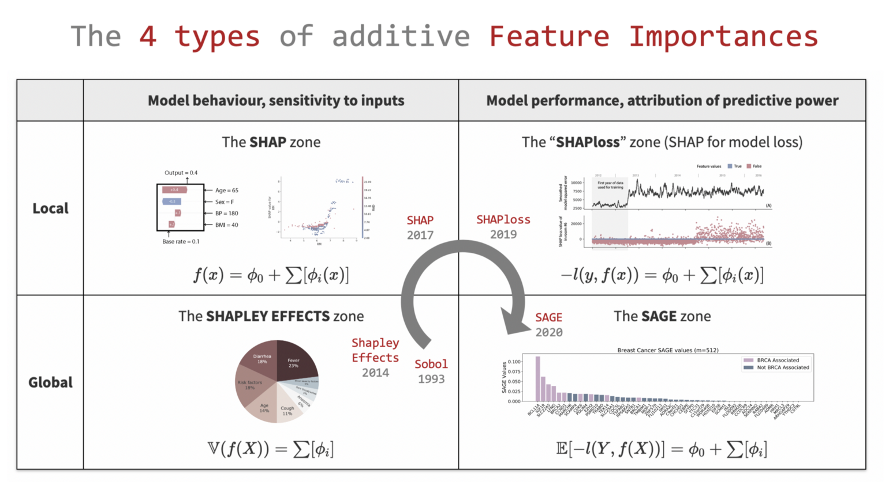

- Shapley value
- [Intepretable-ml-book](https://christophm.github.io/interpretable-ml-book/extend-lm.html)

## Feature Importance

-   Does not include model predictions, e.g. [Correlation Feature Selection](https://en.wikipedia.org/wiki/Feature_selection#Correlation_feature_selection)  & Mutual Information
-   Used before running the model as feature selector
-   Model-Specific feature importance method such as Random Forest Feature Importance

## Feature Ablation

-   related to`stepwise regression` 

-   https://www.samueltaylor.org/articles/feature-importance-for-any-model.html

    

## Sensitivity Analysis

-   [Understand Your Black Box Model Using Sensitivity Analysis — Practical Guide](https://medium.com/@einat_93627/understand-your-black-box-model-using-sensitivity-analysis-practical-guide-ef6ac4175e55)

    >   To calculate feature sensitivity we change the feature value or try to ignore it somehow while all the other features stay constant, and see the output of the model.

    >   Formally, given a test set *X*, we would like to measure the sensitivity of feature i. We create a new set *X** where we apply a transformation T over feature i. We perform prediction on *X* and denote the prediction vector as *Y*. We perform prediction on *X** and denote the prediction vector as *Y**. To measure the change in the outcome we use our score metric while using *Y* as the true y. We let *S* be the original score — this is the score of the model on *X* (for accuracy for example, this will be 1) and *S** be the new score, the score after changing the feature value. The sensitivity for feature i will then be *S-S**.

-   Global Intepretability
    -   Feature Sensitivity
        -   Transformation Types: Uniform distribution, Permuation, (simulate) Missing Values
    -   PDP
-   Local Intepretability 
    -   LIME
    -   SHAP

## 4 Types of addictive feature importance

