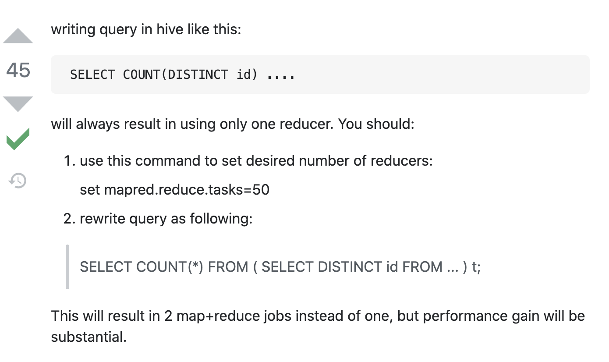

-   [AWS What is hive?](https://aws.amazon.com/big-data/what-is-hive/)
-   https://www.lsbin.com/6520.html 3种连接方式
-   https://stackoverflow.com/questions/47334686/pyhive-connection-error-thrift-transport-ttransport-ttransportexception-tsocke
-   https://www.tutorialspoint.com/hive/hive_quick_guide.htm

### installation

-   需要的rpm包

    ```
    libgsasl.x86_64
    ```

-   working version：

    -   ```shell
        sasl = 0.3.1
        thrift-sasl = 0.4.3
        thrift = 0.10.0
        pyhive = 0.6.4
        python = 3.7
        ```

-   Error sasl client could not start

    -   1.   注意如果`auth="NOSASL"`, 那么服务器端的hive-site.xml 中的认证方式也必须配成noSasl， 如果是None，client端不要写成NOSASL
    -   2.   版本冲突导致https://github.com/dropbox/PyHive/issues/161
    -   3.   另一个回答， 但感觉其实不是缺依赖lib https://blog.csdn.net/u010916338/article/details/97400444

-   Error TSocket read 0 bytes 在auth=None时消失
    -   别人的问题

    -   https://github.com/cloudera/impyla/issues/268

    -   LDAP/password 认证 https://github.com/dropbox/PyHive/issues/143

        

### HIVE SQL

-   change column dtype

https://www.edureka.co/community/49993/how-can-you-change-a-column-data-type-in-hive

```sql
ALTER TABLE table_name CHANGE column_name column_name new_datatype;

# 其他sql 使用 ALTER COLUMN 而不是 CHANGE
```

-   ```sql
    show indexes on table
    ```

-   create index `with deferred rebuild`

    https://www.dummies.com/programming/big-data/hadoop/improving-your-hive-queries-with-indexes/

### hive data types

https://cwiki.apache.org/confluence/display/hive/languagemanual+types

## hive sgl insert - transactional orc table

-   普通orc table只能全表导入
-   要支持单条插入必须是事物表
-   
-   https://sqlandhadoop.com/hive-transactional-tables-everything-you-must-know-part-1/#2_Table_must_have_CLUSTERED_BY_column

## hive 建表

-   2021-12-2 直接用sqlalchemy 建表 失败， 使用 `pd.to_sql(if_exists='replace')`也失败
    -   -> 报 table not found
-   最后： 直接使用sql语句建表 -> `connection.execute(create_sql_str)` + `pd.to_sql(if_exists='append'`)

-   注意设置`transactiona=true`不要拼错

### set mapreduce reducer number

-   https://stackoverflow.com/questions/8762064/hive-unable-to-manually-set-number-of-reducers

    

## update table

-   必须是table，不能是view

-   必须是transaction table

-   必须有where 子句

-   Hive 中不是`REPLACE`

-   ```sql
    update [tbl] set [col] = regex_replace([col], "*", '') where id is not null;
    ```

#### `REGEX_REPLACE`

-   https://docs.oracle.com/cd/B19306_01/server.102/b14200/functions130.htm
