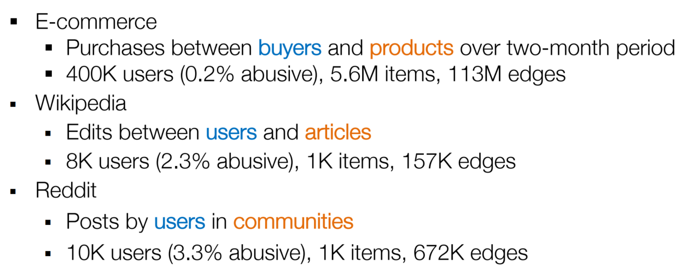

# 1. Dynamic Bipartite Graph for abuse detection in e-commerce

- 
- 
- 

## Dynamic Architecture: 3 phases

- 

### 1. User round: RNN phase

### 2. Item&User Round: GNN Phase

- no learning parameters

### 3. Prediction

## Scalable Training

## Self-supervised Pretraining Framework

## Experiments:

## Conclusion

- **Integrating time series and graph information** leads to significant improvement in abuse detection
- **Alternating training** is a high-performing, scalable approach to node classification on dynamic graphs
- **Pretraining** on anomaly detection objectives can improve performance in label-sparse settings  

## References

# 2. Large-Scale Reasoning over Knowledge Graphs  

- KGs are Heterogeneous graph

## Goal: Complex Logical Reasoning on KG

- For example:
  - Where did Canadian Turing Award winners graduate?
  - Who are current presidents of European countries which never held a (soccer) world cup?
  - Predict drugs that might target proteins that are associated with SARS-CoV2?
-   
- 

## Traditional Approach

- 

## Challenges

- **incomplete & noisy** 
  -  how to capture **uncertainty**?
  - how to impute **missing** relations?
- **completing the KG** creates **additional links**, which further slows down query answering

- **transversing** requires time exponential in query depth 
  - how to **efficiently** answer queries on **large graphs**

## Task: KG Reasoning -> Complex Link Prediction

## Solution 

- Map Logical queries into embedding space
- Reasoning in the embedding space

### 1. Framework: Query2Box

- map logical operators in learning space 
- Key Insight
  - **Represent query as a box**
  - (logical) operations (Intersection etc.) are well defined over boxes
- Idea:
  - Embed nodes of the graph
  - For every logical operator learn a spatial operator
- So that:
  - Take an arbitrary logical query. Decompose it into a set of logical operators (∃,∧,∨)
  - Apply **a sequence of spatial operators** to **embed the query**
  - Answers to the query are **entities close to the embedding of the query**  (i.e. neighbors)
- 

### 2. Embedding Queries

- 
- 

### 3. Examples

### 4. Handle Disjunction

Given an arbitrary AND-OR query :

- Transform it into an DNF (disjunctive normal form)
- Answer each conjunctive query
- Overall answer is the union of conjunctive query answers  

## Benefits

- Scalability & efficiency
  - Any query can be reduced to **a couple of matrix operations** and **a single k-nearest neighbor search**  
- Generality
  - We can answer any query (even those we have never seen before)  
- Robustness to noise
  - Graph can contain missing and noisy relationships  

## Contrastive Self-supervised training

- 

## ==Large-Scale Training==

## References

- [Embedding Logical Queries on Knowledge Graphs. Hamilton, et al., NeurIPS 2018]
- [[Query2box: Reasoning over Knowledge Graphs in Vector Space Using Box Embeddings. Ren, et al., ICLR 2020]  

- Scaling up Logical Query Embeddings on Knowledge Graphs. H. Ren, H. Dai, B. Dai, X. Chen, D. Zhou,
  J. Leskovec, D. Schuurmans. ICML SSL workshop 2021.
- Beta Embeddings for Multi-Hop Logical Reasoning in Knowledge Graphs. H. Ren, J. Leskovec. NeurIPS 2020.
- LEGO: Latent Execution-Guided Reasoning for Multi-Hop Question Answering on Knowledge Graphs. H. Ren, H. Dai, B. Dai, X. Chen, M. Yasunaga, H. Sun, D. Schuurmans, J. Leskovec, D. Zhou. ICML SSL workshop 2021.
- Code:
  - https://github.com/snap-stanford/KGReasoning
  - https://github.com/snap-stanford/SrKG  