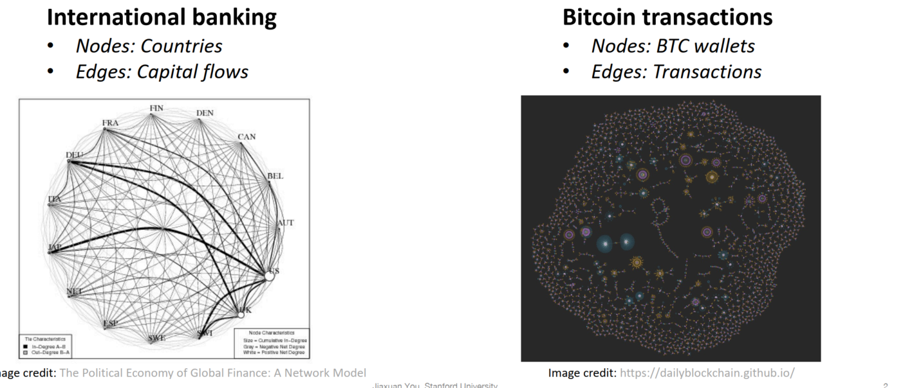
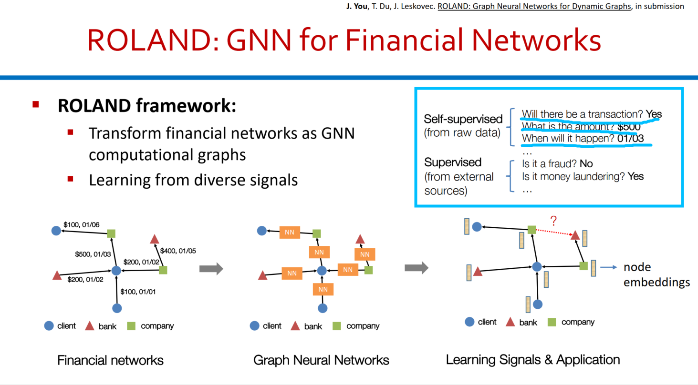
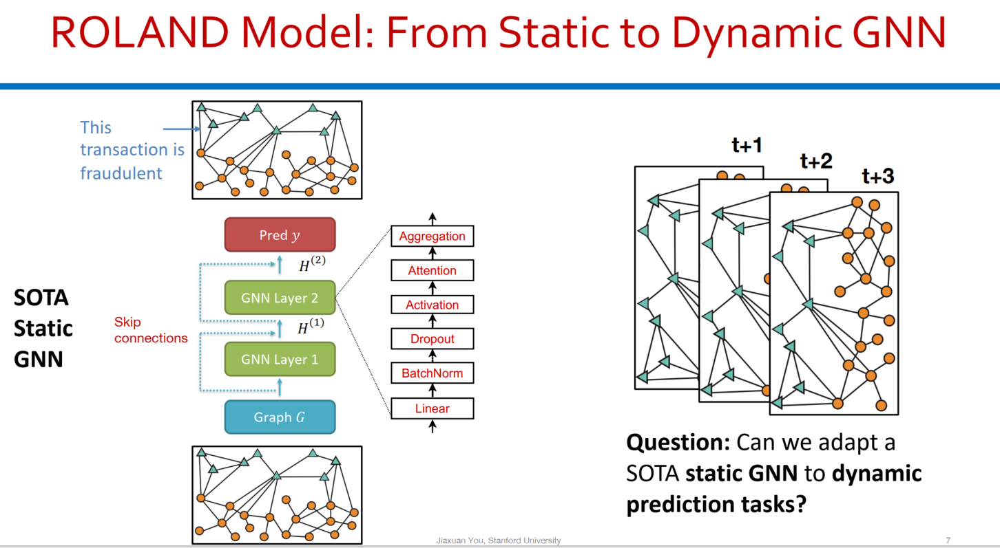
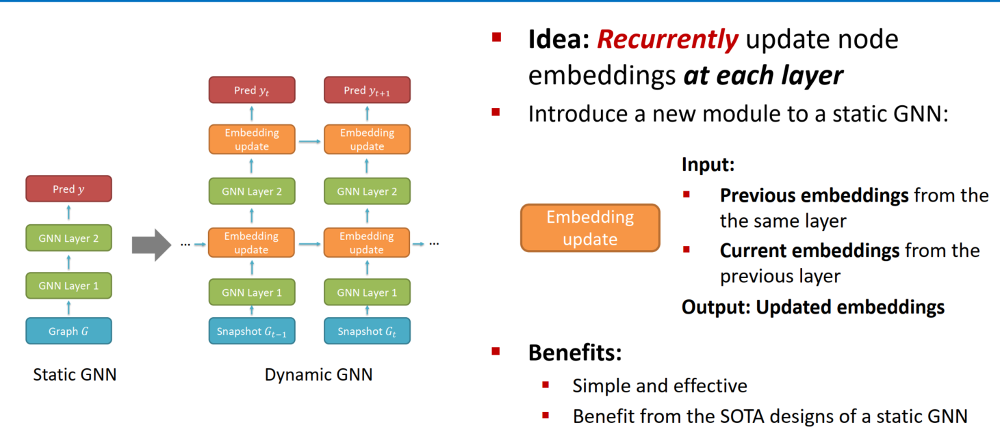

## 1. Finance Graph

- 

## 2. Solution: Graph Representation Learning

- 

### 2.1 **与金融相关的任务类型**

- 

### 2.2 Dynamic GNN

- 

#### Idea: **Recurrently update node embeddings** at each layer  

#### Efficient Training

