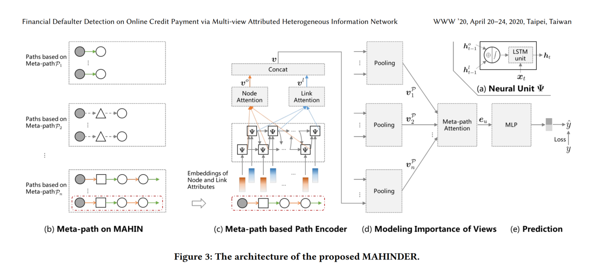
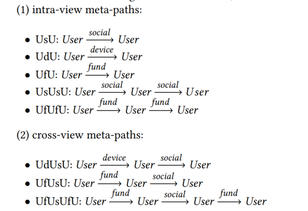

## Financial Defaulter Detection on Online Credit Payment via Multi-view Attributed Heterogeneous Information Network  

- 2020 WWW 蚂蚁+阿里

### multiview - HCN

- 异质图 

- 2种节点 

  - Users(user, merchant) & Log-in Devices(phone, computer)

- 3种边(views): 

  - social: families, friend, workmate, etc.
  - fund: trade, transfer, etc.
  - device: log-in

- 对应不同default类型的meta-path模板， e.g.

  - 欺诈：
    $$
    User \xrightarrow{device} User \xrightarrow{social}Users
    $$

    > fraud users may register many accounts via
    > social-related ID cards and login them on limited devices, which
    > combines the social and device relationships and derives the metapath “UdUsU”.  

  - 套现
    $$
    User \xrightarrow{fund} User \xrightarrow{fund}User \\
    User \xrightarrow{fund} User \xrightarrow{social} User \xrightarrow{fund} User
    $$

    > Cash-out users may transfer money among a lot of
    > nodes and try to make the fund path as deep as possible, which
    > derives meta-paths like “UfUfU” and “UfUsUfU”  

  - 每种meta-path包含两个sub-sequence： node-level & link-level
  - 

- 将异质图节点分类问题转为每个独立样本(Users)包含多个sequence特征的一般分类问题 

  - lstm + attention
  - 并没有用到图神经网络

- 对每个target user， 对他采集到的每种类型meta-sequence encoding进行聚合作为最终的user embedding， 并使用attention进行重要性计算

- 验证数据集：

  - alibaba真实数据集

- related field

  - financial defaulter detection
  - heterogeneous information network(HIN)

- ==问题：==

  - ==实时建图？边关系使用多长的时间窗来推断？==