# 构建区块链互联生态的思考与实践

- 中科院计算技术研究所 - 孙毅
- 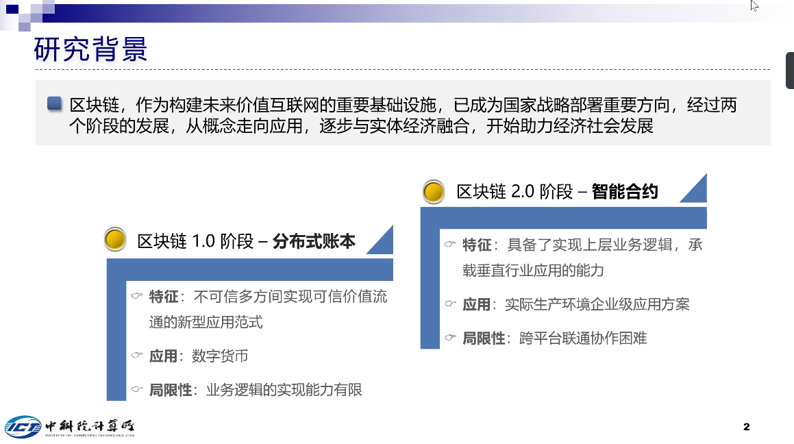
- 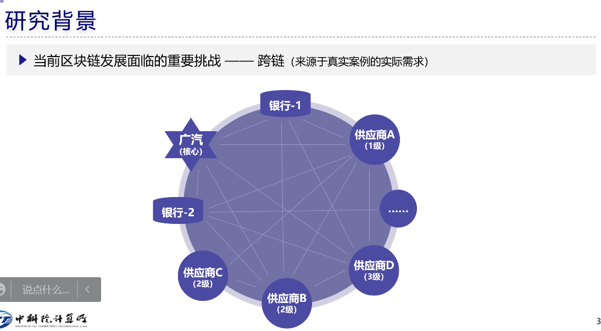

## 区块链3.0

- 供应链金融
- 无法要求大家都加入同一条链
  - 银行存在展业限制 - 
  - 银行间不愿意加入同一个区块链， e.g. 南京、杭州
  - 多个核心企业合并成一条链会造成特别多节点
- 解决方法：跨链
- 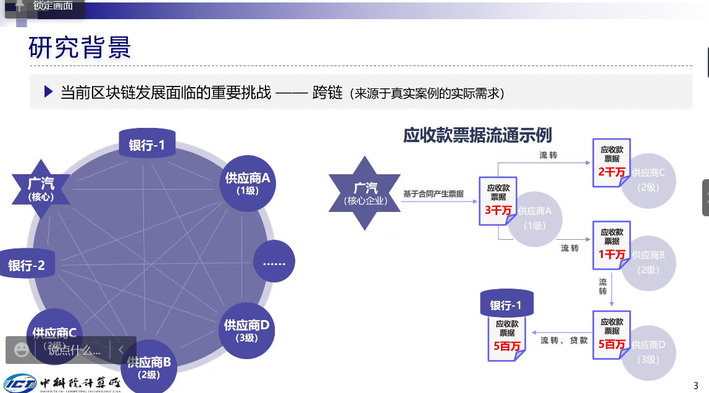

- 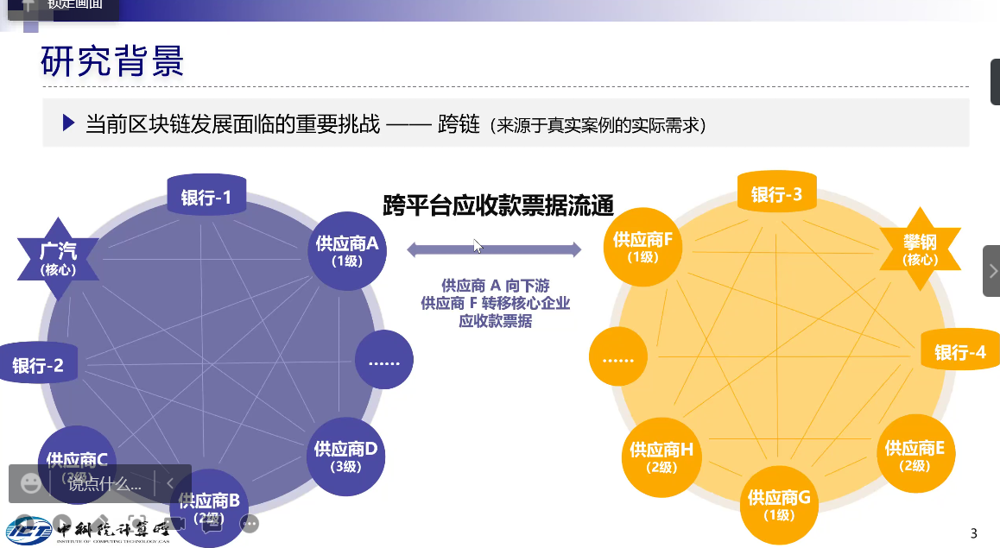
- 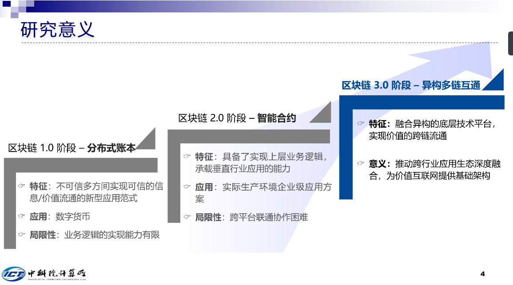

## 区块链互操作(跨链操作)

- 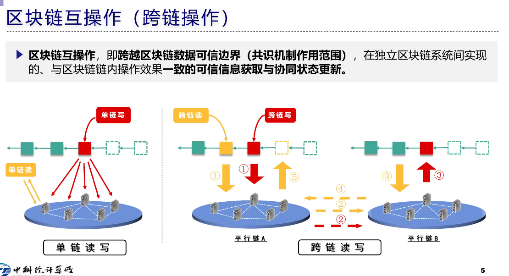

- 互操作：
  - 广义：
    - 区块链与上层应用
    - 区块链与区块链之外的应用操作
  - 狭义：
    - 区块链与区块链之间的操作
- 什么是单链？
- 什么是跨链？

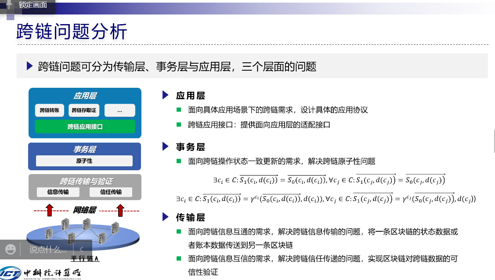

- 传输层解决两个问题：

  1. 信息传输

  2. 信任传递 - 边传边验

- 事务层

  - 复杂区块链解决更新一致性

- 应用层

  - 单链与跨链应用不能完全兼容
  - 开发针对跨链的应用协议和接口

## 跨链需要满足什么需求

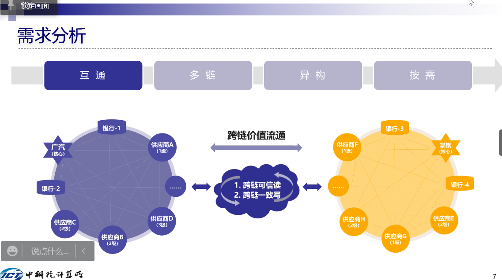

- 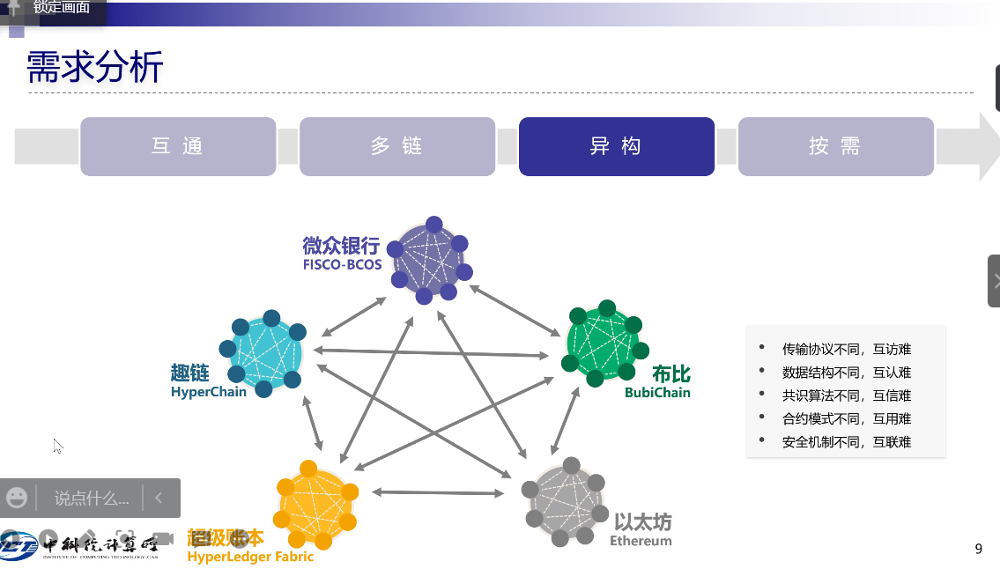

- 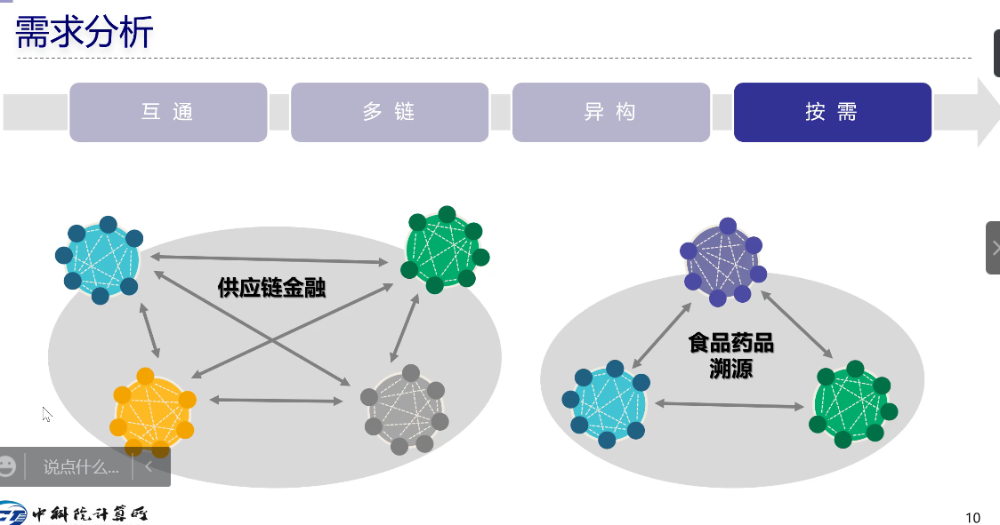

  

- 互通： 实现两个基本操作

  1. 跨链可信度
  2. 更新一致性

- 联盟链

  - 多链互联

- 异构链

- 按需，e.g.

  - 供应链金融：对安全性、原子性 要求更高
  - 食品药品溯源：对吞吐量要求更高

## 整体解决方案

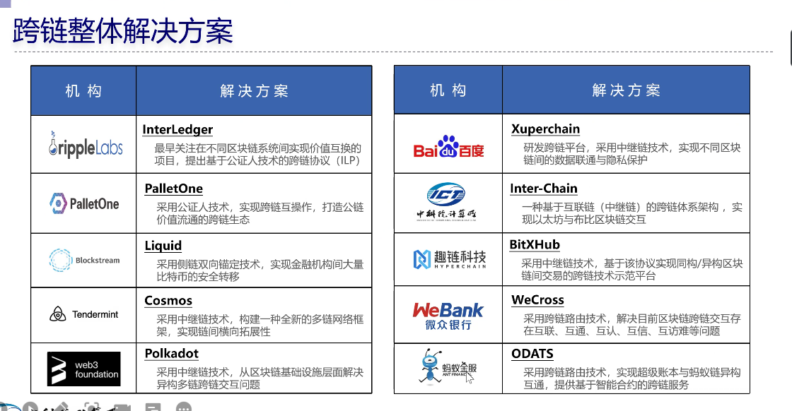

- 距理想异构多链互联体系有差距

## 中科院提出的跨链体系

- 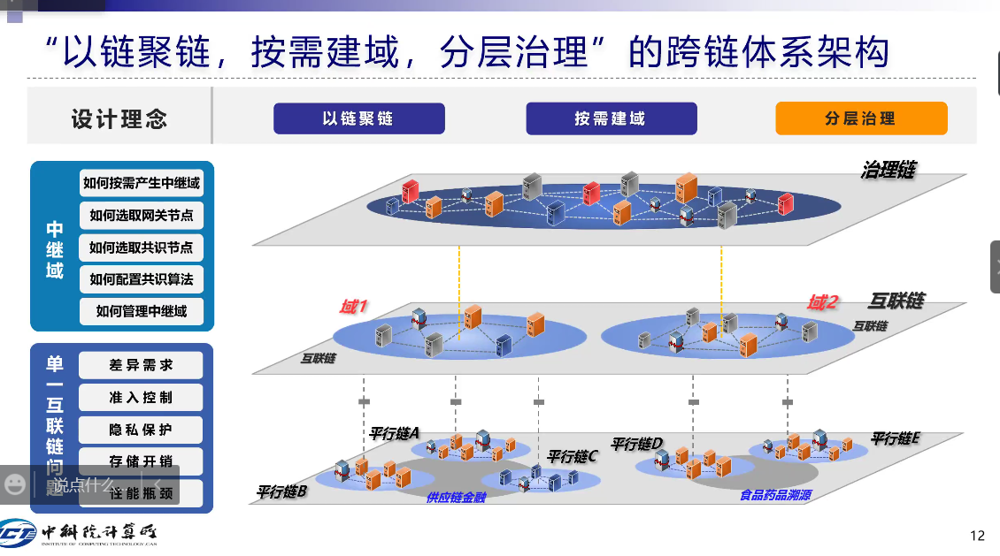
- 从互联网借鉴思路
  - 以链聚链
    - 避免链间点连接
  - 按需建域
    - 每个域管一组平行链
  - 分层治理

- 跨链交互协议栈

  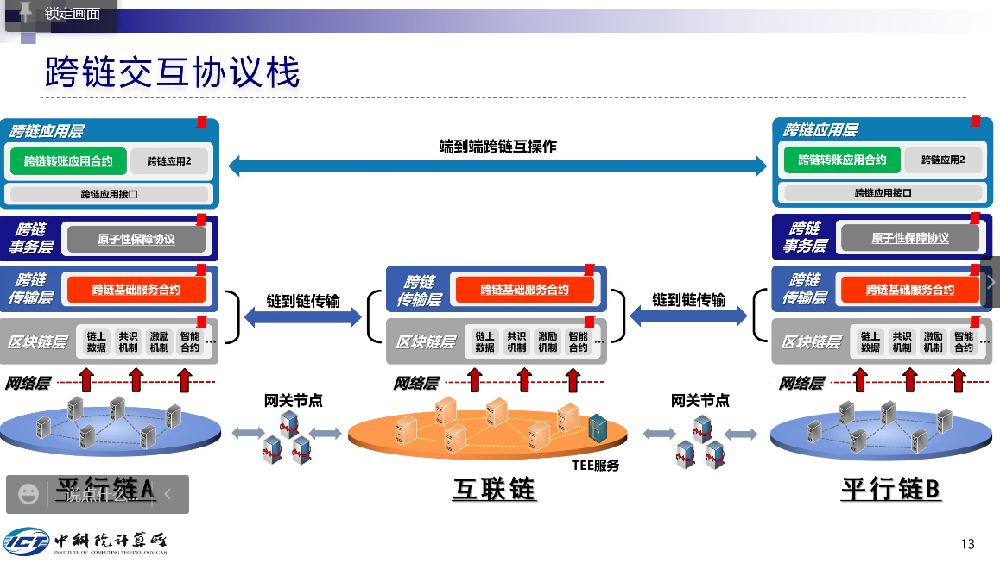

  - 类似TCPIP协议
  - 单项一次交易传输过程：
  - 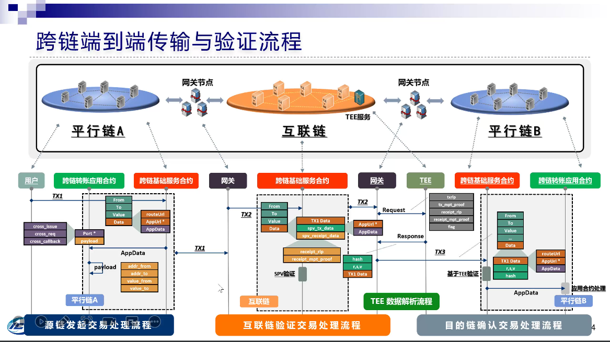

  - 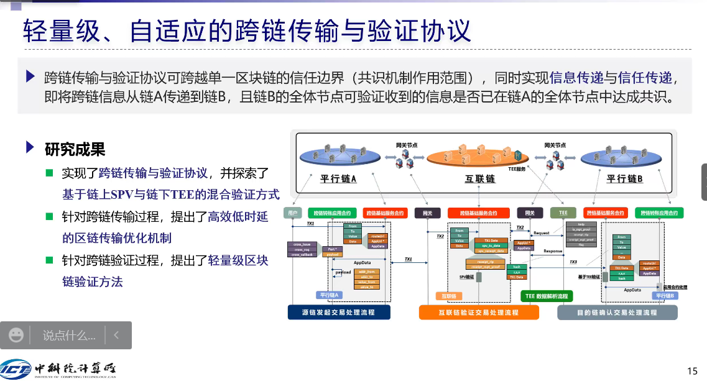
  - 与传统P2P协议需求不完全相同
    - 各种分层思想， 递归缓解根节点的传输压力 ： 要求广播最初到达的几个节点压力小
    - 但区块链广播需要的是“共识”：min-max, 要求最差的几个节点压力尽可能小
  - 验证：
    - 现在：区块头SPV验证， 不需要保存全量数据
    - 但如果连区块头存储能力和计算能力可能达不到， 或者计算能力连SVP也达不到， 比如传感器节点
      - 类似代理节点？

## 共识和共识匹配机制

- 不同的域对共识要求不一样
- 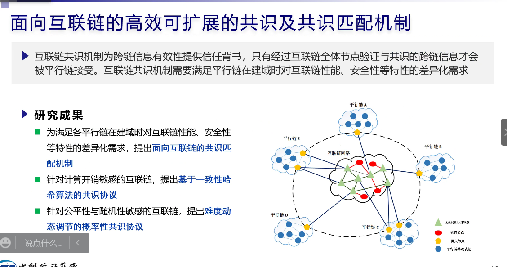
- 监管链进行规则匹配, 选择共识算法
- 现有算法：BFT轮询, ....
- 联盟链对于公平性和随机性敏感要求高
  - 出块？

## 分层治理

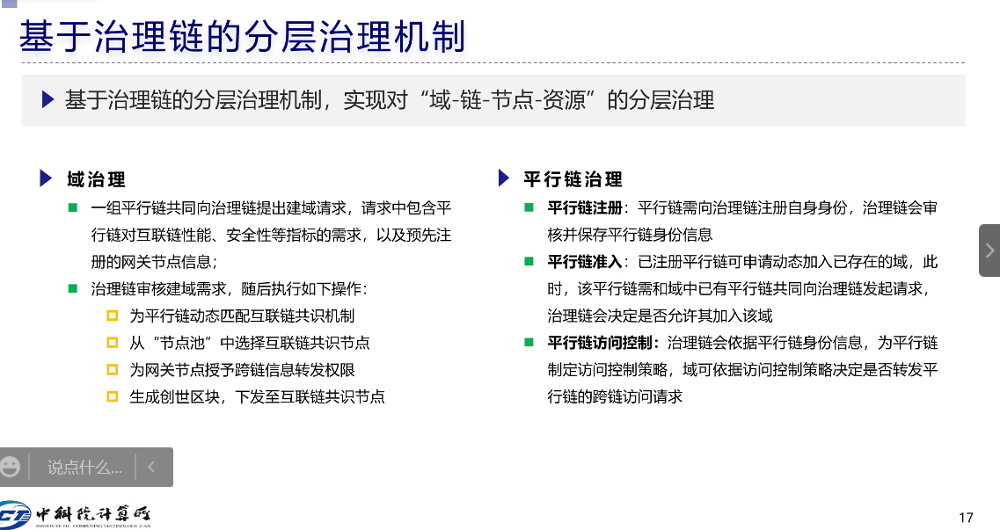

## 平台展示

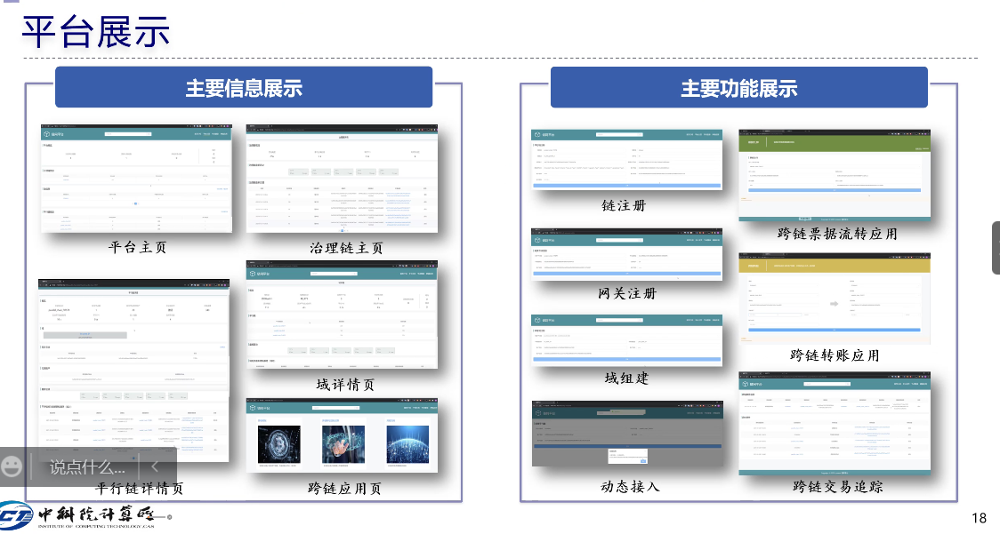

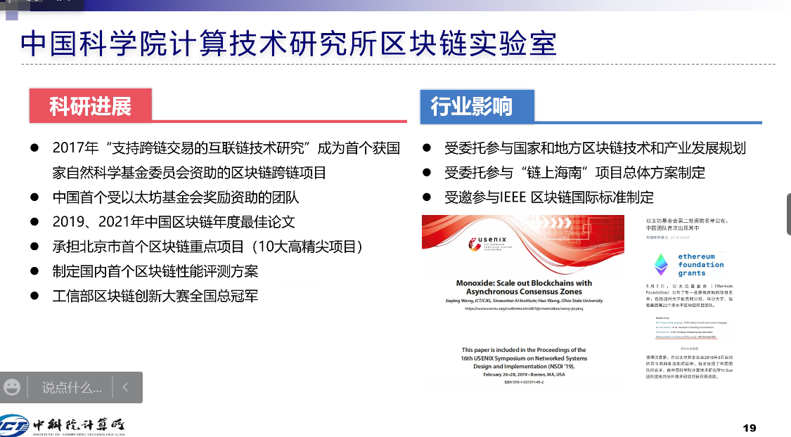

## QA

### 区块链上的隐私保护

- 存在性证明
- 有效性验证
  - 主要有两种区块链: 先执行后排序 vs先排序后执行
    - 先排序后执行可能无法传递执行是否成功的信息
    - challenge: 在不执行另一条区块链的交易的前提下保证状态正确性
    - 现有一些方案：以太坊落盘证明