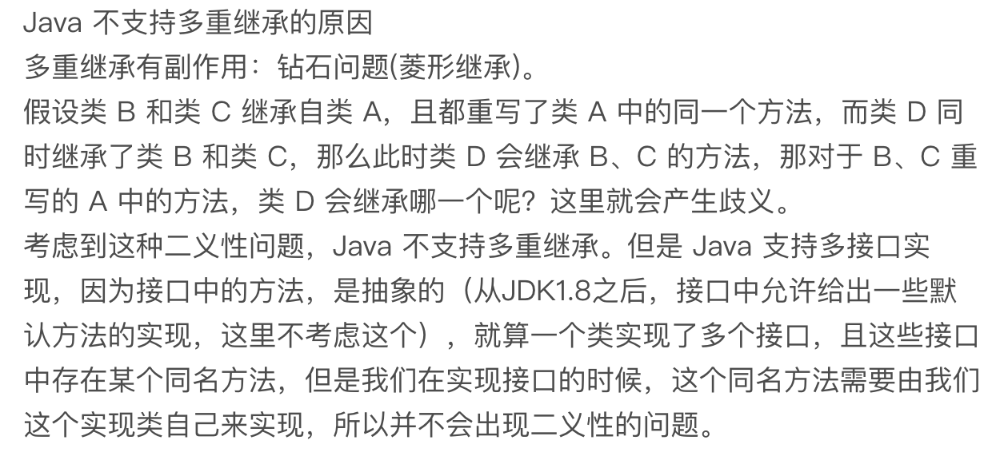

## 04 面向对象 {#04}

-   **面向对象编程**是一种编程范式或编程风格。它以类或对象作为组织代码的基本单元，并将封装、抽象、继承、多态四个特性，作为代码设计和实现的基石 。
-   **面向对象编程语言**是支持类或对象的语法机制，并有现成的语法机制，能方便地**实现面向对象编程四大特性**（封装、抽象、继承、多态）的编程语言。

-   面向对象分析 OOA (what) + 面向对象设计 OOD (how)
    -   输出： 类的设计
        -   程序拆解为哪些类
        -   每个类有哪些属性方法
        -   类于类之间如何交互

-   UML 统一建模语言

    -   [uml cheatsheet](https://github.com/gdhucoder/Algorithms4/blob/master/designpattern/pic/umlcheatsheet.jpg)

    -   [introduction notes](https://github.com/gdhucoder/Algorithms4/tree/master/designpattern/pic)

         

## 05 封装、抽象、继承、多态

### 1 封装 Encapsulation

-   Aka. 信息隐藏、数据访问保护
-   类通过暴露有限的访问接口，授权外部仅能通过类提供的方式(函数)来访问内部信息或数据
-   需要的语法机制：访问权限控制
    -   java： private、public、protected + getter/setter etc.
-   目的： 
    -   一方面是保护数据不被随意修改，提高代码的可维护性；
    -   另一方面是仅暴露有限的必要接口，提高类的易用性。


### 2 抽象 Abstraction

-   隐藏方法的具体实现，调用者只需关系方法提供的功能
-   抽象可以通过接口类或者抽象类来实现：e.g. 接口类(Java interface)或抽象类(Java abstract)
-   语法机制：函数
-   目的：
    -   一方面是提高代码的可扩展性、维护性，修改实现不需要改变定义，减少代码的改动范围；
    -   另一方面，它也是处理复杂系统的有效手段，能有效地过滤掉不必要关注的信息。


### 3 继承 Inheritence

-   is-a
-   目的: 主要是用来解决代码复用的问题。
-   单继承
-   多继承： 一个子类可以继承多个父类
    -   但是初始化顺序重要
-   Java ： 单继承 `extends`
    -   但是有接口类implements 可以实现多继承
-   C++: 多继承 (`class B: public A`)
-   Python: 多继承
-   争议： **多用组合少用继承**的设计思想
    -   菱形继承问题 - python使用MAP解决， java通过接口类抽象实现解决
    -   

### 4 多态 Polymorphism

-   子类可以替换父类， 在实际代码运行过程中，调用子类的方法实现

-   python 动态类型天生支持多态

-   语法机制： 

    -   1.   **父类对象可以引用子类对象**
        2.   语言支持继承
        3.   子类可以重写(override)

-   实现方式

    1.   继承+ 方法重写(by extending parents (sothat `isinstance(parent type == true)`) & `overriding` parents' methods)
    2.   接口类语法： 多个类必须是同一个接口类的实现
    3.   duck-typing 语法： 类只要实现同样的methods， 动态语言支持

    >   只要两个类具有相同的方法，就可以实现多态，并不要求两个类之间有任何关系，这就是所谓的 duck-typing，是一些动态语言所特有的语法机制。而像 Java 这样的静态语言，通过继承实现多态特性，必须要求两个类之间有继承关系，通过接口实现多态特性，类必须实现对应的接口。

-   相关设计原则
    -   策略模式
    -   基于接口而非实现编程
    -   依赖倒置原则
    -   里式替换
    -   利用多态去掉冗长的if-else

## 06 & 07 面向对象 vs 面向过程

### 1. 什么是面向过程编程与面向过程编程语言？

-   [面向对象](#04) 

-   面向过程

    -   面向过程编程也是一种编程范式或编程风格。它以过程（可以理解为方法、函数、操作）作为组织代码的基本单元，以数据（可以理解为成员变量、属性）与方法相分离为最主要的特点。

    -   面向过程风格是一种流程化的编程风格，通过拼接一组顺序执行的方法来操作数据完成一项功能。面向过程编程语言首先是一种编程语言。它最大的特点是不支持类和对象两个语法概念，不支持丰富的面向对象编程特性（比如继承、多态、封装），仅支持面向过程编程。

### 2. 面向对象编程相比面向过程编程有哪些优势？

-   对于大规模复杂程序的开发，程序的处理流程并非单一的一条主线，而是错综复杂的网状结构。面向对象编程比起面向过程编程，更能应对这种复杂类型的程序开发。
-   面向对象编程相比面向过程编程，具有更加丰富的特性（封装、抽象、继承、多态）。利用这些特性编写出来的代码，更加易扩展、易复用、易维护。
-   从编程语言跟机器打交道的方式的演进规律中，我们可以总结出：面向对象编程语言比起面向过程编程语言，更加人性化、更加高级、更加智能。

### 3. 为什么说面向对象编程语言比面向过程编程语言更高级？

>   跟二进制指令、汇编语言、面向过程编程语言相比，面向对象编程语言的编程套路、思考问题的方式，是完全不一样的。前三者是一种计算机思维方式，而面向对象是一种人类的思维方式。我们在用前面三种语言编程的时候，我们是在思考，如何设计一组指令，告诉机器去执行这组指令，操作某些数据，帮我们完成某个任务。而在进行面向对象编程时候，我们是在思考，如何给业务建模，如何将真实的世界映射为类或者对象，这让我们更加能聚焦到业务本身，而不是思考如何跟机器打交道。可以这么说，越高级的编程语言离机器越“远”，离我们人类越“近”，越“智能”。

### 4. 有哪些看似是面向对象实际是面向过程风格的代码？

>   1.   滥用 getter、setter 方法在设计实现类的时候，除非真的需要，否则尽量不要给属性定义 setter 方法。除此之外，尽管 getter 方法相对 setter 方法要安全些，但是如果返回的是集合容器，那也要防范集合内部数据被修改的风险。
>   2.   Constants 类、Utils 类的设计问题对于这两种类的设计，我们尽量能做到职责单一，定义一些细化的小类，比如 RedisConstants、FileUtils，而不是定义一个大而全的 Constants 类、Utils 类。除此之外，如果能将这些类中的属性和方法，划分归并到其他业务类中，那是最好不过的了，能极大地提高类的内聚性和代码的可复用性。
>   3.   基于贫血模型的开发模式(MVC)。关于这一部分，我们只讲了为什么这种开发模式是彻彻底底的面向过程编程风格的。这是因为数据和操作是分开定义在 VO/BO/Entity 和 Controler/Service/Repository 中的。今天，你只需要掌握这一点就可以了。为什么这种开发模式如此流行？如何规避面向过程编程的弊端？有没有更好的可替代的开发模式？相关的更多问题，我们在面向对象实战篇中会一一讲解。

### 5. 在面向对象编程中，为什么容易写出面向过程风格的代码？

### 6.面向过程编程和面向过程编程语言就真的无用武之地了吗？

### 使用面向过程语言编写面向对象代码

-   尽管面向过程编程语言可能没有现成的语法来支持面向对象的四大特性，但可以通过其他方式来模拟，比如在 C 语言中，我们可以利用函数指针来模拟多态。

-   使用struct + 函数指针 实现数据和方法的耦合 -> simulate a class

-   >   C中可以用struct 来实现class，只是访问控制权限都是public。
    >
    >   类中的**成员函数**可以通过指向操作结构体的函数指针来实现，实现封装，需要绑定数据、函数、函数指针。可以创建**函数指针表**，构造函数设置函数指针指向正确的操作函数，函数指针表作为**对象访问函数的接口**。操作结构体的这些函数（成员函数）不像C++中能直接访问数据成员，需要**显示的传递操作对象**给成员函数。
    >   继承：在派生类中维护一个基类对象的指针。这样派生类可以访问基类对象的数据。
    >   多态：在基类中维护一个派生类对象的指针。这样基类可以访问派生类对象的数据。
    >   C++中的多态，有一个对象销毁的问题。基类的析构函数必须是虚函数。在C中，这可以通过使基类的删除函数指针指向派生类的删除函数，因为派生类的删除函数清楚派生类的数据和基类的数据

```C
typedef struct _Base Base;
typedef void (*fptrDisplay)(Base*);
typedef void (*fptrDelete)(Base*);
void DisplayBase(Base* );
void DeleteBase(Base*);

typedef struct _Base
{
  void* pDeriveObj;
  int a;
  int b;
  fptrDisplay Display;
  fptrDelete Delete;
}Base;

Base* new_base(int a, int b)
{
  Base* pObj = NULL;
  pObj = (Base*)malloc(sizeof(Base));
  if (pObj == NULL)
  {
  	return NULL;
  }
  
  // 当创建基类对象时指向自己
  pObj->pDeriveObj = pObj;
  pObj->a = a;
  pObj->b = b;
  pObj->Display = DisplayBase;
  pObj->Delete = DeleteBase;
  return pObj;
}
void DisplayBase(Base* base)
{
	printf("member: a:%d\t b:%d\n", base->a, base->b);
}
void DeleteBase(Base* base)
{
  printf("base destructor!\n");
  free(base);
}


typedef struct _Derive
{
  Base* pBaseObj;
  int c;
  int d;
}Derive;

void DeriveDisplay(Base* base);
void DeriveDelete(Base* base);

Base* new_Derive(int a, int b, int c, int d)
{
  Derive* pObj = NULL;
  Base* pBaseObj = new_base(a, b);
  pObj = malloc(sizeof(Derive));
	if (!pObj)
  {
    pBaseObj->Delete(pBaseObj);
    return NULL;
  }
  pBaseObj->pDeriveObj = pObj;
  pObj->pBaseObj = pBaseObj;
  pObj->c = c;
  pObj->d = d;
  pBaseObj->Display = DeriveDisplay;
  pBaseObj->Delete = DeriveDelete;
  return pBaseObj;
}
void DeriveDisplay(Base* base)
{
  Derive* pDeriveObj = (Derive*)(base->pDeriveObj);
  printf("member:base:a:%d\t base:b:%d\nderive:c:%d\t derive:d:%d\n", base->a, base->b, pDeriveObj->c, pDeriveObj->d);
}
void DeriveDelete(Base* base)
{
  printf("derive destructor!\n");
  free(base->pDeriveObj);
  free(base);
}


int main()
{
  Base* pBase = new_base(1, 2);
  Base* pDerive = new_Derive(3, 4, 5, 6);
  pBase->Display(pBase);
  pDerive->Display(pDerive);
  pBase->Delete(pBase);
  pDerive->Delete(pDerive);
}
```

-   用c模拟对象https://mp.weixin.qq.com/s/2ivQ9hcRvZnhk89jzAppSg

-   **滥用面向对象继承特性的代码**

## 08 抽象类 vs 接口

-   我们可以使用接口来实现面向对象的抽象特性、多态特性和基于接口而非实现的设计原则，使用抽象类来实现面向对象的继承特性和模板设计模式等等

-   并不是所有的面向对象编程语言都支持这两个语法概念，比如，C++ 这种编程语言只支持抽象类，不支持接口；而像 Python 这样的动态编程语言，既不支持抽象类，也不支持接口。

### 抽象类：

-   抽象类具有哪些特性 (in JAVA)

    -   抽象类不允许被实例化，只能被继承。也就是说，你不能 new 一个抽象类的对象出来（Logger logger = new Logger(...); 会报编译错误）。

    -   抽象类可以包含属性和方法。方法既可以包含代码实现（比如 Logger 中的 log() 方法），也可以不包含代码实现（比如 Logger 中的 doLog() 方法）。不包含代码实现的方法叫作抽象方法。

    -   子类继承抽象类，必须实现抽象类中的所有抽象方法。对应到例子代码中就是，所有继承 Logger 抽象类的子类，都必须重写 doLog() 方法。

-   目的： **优雅的****代码复用** - 继承 & 多态(相比于简单的父类 + 子类新函数)

-   Example:

    ```Java
    
    // 抽象类
    public abstract class Logger {
      private String name;
      private boolean enabled;
      private Level minPermittedLevel;
    
      public Logger(String name, boolean enabled, Level minPermittedLevel) {
        this.name = name;
        this.enabled = enabled;
        this.minPermittedLevel = minPermittedLevel;
      }
      
      public void log(Level level, String message) {
        boolean loggable = enabled && (minPermittedLevel.intValue() <= level.intValue());
        if (!loggable) return;
        doLog(level, message);
      }
      
      protected abstract void doLog(Level level, String message);
    }
    // 抽象类的子类：输出日志到文件
    public class FileLogger extends Logger {
      private Writer fileWriter;
    
      public FileLogger(String name, boolean enabled,
        Level minPermittedLevel, String filepath) {
        super(name, enabled, minPermittedLevel);
        this.fileWriter = new FileWriter(filepath); 
      }
      
      @Override
      public void doLog(Level level, String mesage) {
        // 格式化level和message,输出到日志文件
        fileWriter.write(...);
      }
    }
    // 抽象类的子类: 输出日志到消息中间件(比如kafka)
    public class MessageQueueLogger extends Logger {
      private MessageQueueClient msgQueueClient;
      
      public MessageQueueLogger(String name, boolean enabled,
        Level minPermittedLevel, MessageQueueClient msgQueueClient) {
        super(name, enabled, minPermittedLevel);
        this.msgQueueClient = msgQueueClient;
      }
      
      @Override
      protected void doLog(Level level, String mesage) {
        // 格式化level和message,输出到消息中间件
        msgQueueClient.send(...);
      }
    }
    ```

    

### 接口：

-   接口类具有哪些特性 (in JAVA)
    -   接口不能包含属性（也就是成员变量）。
    -   接口只能声明方法，方法不能包含代码实现。
    -   类实现接口的时候，必须实现接口中声明的所有方法。
    -   i.e. “定义”： 接口中没有成员变量，只有方法声明，没有方法实现，实现接口的类必须实现接口中的所有方法。
-   对于动态编程语言来说，还有一种对接口支持的策略，那就是 duck-typing

-   example：

    ```Java
    
    // 接口
    public interface Filter {
      void doFilter(RpcRequest req) throws RpcException;
    }
    // 接口实现类：鉴权过滤器
    public class AuthencationFilter implements Filter {
      @Override
      public void doFilter(RpcRequest req) throws RpcException {
        //...鉴权逻辑..
      }
    }
    // 接口实现类：限流过滤器
    public class RateLimitFilter implements Filter {
      @Override
      public void doFilter(RpcRequest req) throws RpcException {
        //...限流逻辑...
      }
    }
    // 过滤器使用Demo
    public class Application {
      // filters.add(new AuthencationFilter());
      // filters.add(new RateLimitFilter());
      private List<Filter> filters = new ArrayList<>();
      
      public void handleRpcRequest(RpcRequest req) {
        try {
          for (Filter filter : filters) {
            filter.doFilter(req);
          }
        } catch(RpcException e) {
          // ...处理过滤结果...
        }
        // ...省略其他处理逻辑...
      }
    }
    ```

    

### 抽象类 vs 接口

-   抽象类更多的是为了代码复用，而接口就更侧重于解耦。接口是对行为的一种抽象，相当于一组协议或者契约，你可以联想类比一下 API 接口。调用者只需要关注抽象的接口，不需要了解具体的实现，具体的实现代码对调用者透明。接口实现了约定和实现相分离，可以降低代码间的耦合性，提高代码的可扩展性。
-   实际上，接口是一个比抽象类应用更加广泛、更加重要的知识点。比如，我们经常提到的“基于接口而非实现编程”，就是一条几乎天天会用到，并且能极大地提高代码的灵活性、扩展性的设计思想。
-   summary: 抽象类是对成员变量和方法的抽象，是一种 is-a 关系，是为了解决代码复用问题。接口仅仅是对方法的抽象，是一种 has-a 关系，表示具有某一组行为特性，是为了解决解耦问题，隔离接口和具体的实现，提高代码的扩展性。

### 什么时候用抽象类/接口？

-   在代码设计、编程开发的时候，什么时候该用抽象类？什么时候该用接口？实际上，判断的标准很简单。如果我们要表示一种 is-a 的关系，并且是为了解决**代码复用**的问题，我们就用抽象类；如果我们要表示一种 has-a 关系，并且是为了**解决抽象而非代码复用**的问题，那我们就可以使用接口。

-   从类的继承层次上来看，抽象类是一种*自下而上*的设计思路，先有子类的代码重复，然后再抽象成上层的父类（也就是抽象类）。而接口正好相反，它是一种*自上而下*的设计思路。我们在编程的时候，一般都是先设计接口，再去考虑具体的实现。

### 模拟接口

#### 1. C++: 使用抽象类  + 虚函数

```C++
class Strategy { // 用抽象类模拟接口
  public:
    virtual ~Strategy();
    virtual void algorithm()=0;
  protected:
    Strategy();
};
```

-   抽象类 Strategy 没有定义任何属性，并且所有的方法都声明为 `virtual `类型（等同于 Java 中的 `abstract `关键字），这样，所有的方法都不能有代码实现，并且所有继承这个抽象类的子类，都要实现这些方法。从语法特性上来看，这个抽象类就相当于一个接口。

#### 2. 使用普通类（假设语言没有abstract关键字）

 ```JAVA
 public class MockInteface {
   protected MockInteface() {}
   public void funcA() {
     throw new MethodUnSupportedException();
   }
 }
 ```

-   我们知道类中的方法必须包含实现，这个不符合接口的定义。但是，我们可以让类中的方法**抛出 MethodUnSupportedException 异常，来模拟不包含实现的接口**，并且能强迫子类在继承这个父类的时候，都去主动实现父类的方法，否则就会在运行时抛出异常。我们将构造函数设置成 protected 属性的，这样就能避免非同包下的类去实例化 MockInterface。不过，这样还是无法避免同包中的类去实例化 MockInterface。为了解决这个问题，我们可以学习 Google Guava 中 @VisibleForTesting 注解的做法，自定义一个注解，人为表明不可实例化。

### 使用普通类模拟抽象类

#### C中的接口

>   谈谈c吧，linux内核的设备驱动总线模型，就但说设备吧，
>
>   抽象类:
>   首先来个通用设备结构体，到了具体设备把通用设备结构体包含了，这是典型的抽象类思想，提炼公共部分做基类，提高复用度。
>   接口，接口实现就是函数指针，不管你的驱动如何实现，接口不变，你就按照函数指针的定义实现函数，任何人都要受控这个函数定义协议。

## 09 “基于接口而非实现编程” - “Program to an interface, not an implementation”

-   实际上，“基于接口而非实现编程”这条原则的另一个表述方式，是“基于抽象而非实现编程”。

-   函数的命名不能暴露任何实现细节。比如，前面提到的 uploadToAliyun() 就不符合要求，应该改为去掉 aliyun 这样的字眼，改为更加抽象的命名方式，比如：upload()。
-   封装具体的实现细节。比如，跟阿里云相关的特殊上传（或下载）流程不应该暴露给调用者。我们对上传（或下载）流程进行封装，对外提供一个包裹所有上传（或下载）细节的方法，给调用者使用。
-   为实现类定义抽象的接口。具体的实现类都依赖统一的接口定义，遵从一致的上传功能协议。使用者依赖接口，而不是具体的实现类来编程。
-   除此之外，很多人在定义接口的时候，希望通过实现类来反推接口的定义。先把实现类写好，然后看实现类中有哪些方法，照抄到接口定义中。如果按照这种思考方式，就有可能导致接口定义不够抽象，依赖具体的实现。这样的接口设计就没有意义了。不过，如果你觉得这种思考方式更加顺畅，那也没问题，只是将实现类的方法搬移到接口定义中的时候，要有选择性的搬移，**不要将跟具体实现相关的方法搬移到接口**中，比如 AliyunImageStore 中的 generateAccessToken() 方法。
-   总结一下，我们在做软件开发的时候，一定要有**抽象意识、封装意识、接口意识**。在*定义接口*的时候，**不要暴露任何实现细节**。**接口的定义只表明做什么，而不是怎么做**。而且，在设计接口的时候，我们要多思考一下，这样的接口设计是否足够∫，是否能够做到在替换具体的接口实现的时候，不需要任何接口定义的改动。
-   如果在我们的业务场景中，**某个功能只有一种实现方式**，未来也不可能被其他实现方式替换，那我们就**没有必要为其设计接口，也没有必要基于接口编程**，直接使用实现类就可以了。除此之外，越是不稳定的系统，我们越是要在代码的扩展性、维护性上下功夫。相反，如果某个系统**特别稳定**，在开发完之后，基本上不需要做维护，那我们就没有必要为其扩展性，投入不必要的开发时间。
-   “基于接口而非实现编程”这条原则，不仅仅可以指导非常细节的编程开发，还能指导更加上层的架构设计、系统设计等。比如，服务端与客户端之间的“接口”设计、类库的“接口”设计。

-   接口的语义是behaves like

    >   其实这篇和上一篇可以讲的更好的。首先，我反对接口是has-a的说法，我坚持接口的语义是behaves like(这个其实我也是在某一本书上看的). 咱们看下哪个更通顺和达意，A AliyunImageStorage has a DataStorage. or A AliyunImageStorage behaves like a DataStorage? 除非你在第一句加上 A AliyunImageStorage has some behaviors of DataStorage. 但这基本也就是behaves like的意思了。
    >   第二，我觉得咬文嚼字的确没有什么意义，但为什么说上述话题，难道讲接口的例子不用出现接口多重继承么，引用我之前留言：拿一个C++中举的多重继承例子来说，吸血鬼分别继承自蝙蝠和人，那么吸血鬼is a蝙蝠么？吸血鬼is a人么？所以其实两个都不是，这就是设计上的语义问题。这里缺失了除了is a的另一个概念，behaves like，也就是多重继承的真义实际上是behaves like，也就是接口的意义。A vampire behaves like humans and bats. 而这是接口能多重的原因，一个类可以具有多重行为，但是不能是多种东西。
    >   所以其实也就是说，只有当前模块涉及到抽象行为的时候，才有必要设计接口，才有可能利用接口多重继承的特性来更好的将各种行为分组。

    >    抽象类在被继承时体现的是 is-a 关系，接口在被实现时体现的是 can-do 关系
    >   例如，Plane can fly. Bird can fly，应该把 fly 定义成一个接口。
    >
    >   -- 参考 《码出自效Java 开发手册》

-   QA:

    -   在今天举的代码例子中，尽管我们通过接口来隔离了两个具体的实现。但是，在项目中很多地方，我们都是通过下面第 8 行的方式来使用接口的。这就会产生一个问题，那就是，如果我们要替换图片存储方式，还是需要修改很多类似第 8 行那样的代码。这样的设计还是不够完美，对此，你有更好的实现思路吗？

        ```JAVA
        // ImageStore的使用举例
        public class ImageProcessingJob {
          private static final String BUCKET_NAME = "ai_images_bucket";
          //...省略其他无关代码...
          
          public void process() {
            Image image = ...;//处理图片，并封装为Image对象
            ImageStore imageStore = new PrivateImageStore(/*省略构造函数*/);
            imagestore.upload(image, BUCKET_NAME);
          }
        ```

        

    -   1、简单工厂方法
        ImageStore imageStore = ImageStoreFactory.newInstance(SOTRE_TYPE_CONFIG);
        config文件可以写类似properties的文件，使用key-value存储。

        缺点：再新增另一种存储手段时，需要修改工厂类和添加新的类。修改工厂类，违反了开放-封闭原则。

        那有没有更好一点的方法呢？

        2、使用反射。
        在配置文件中定义需要的image store类型。
        在ProcessJob中
        ImageStore store = (ImageStore) Class.forName(STORE_CLASS)
          .newInstance();

        缺点：使用反射，在大量创建对象时会有性能损失。

        关于减少ProcessJob中的修改，还有没有更好的方法呢？我只是抛砖引玉，希望和大家一起讨论。具体实现：https://github.com/gdhucoder/Algorithms4/tree/master/geekbang/designpattern/u009

        补充：
        关于access token：Aliyun的AccessToken时有expireTime时限的。不需要每次重新获取，过期时重新获取即可。

## 10. 为何说要多用组合少用继承？如何决定该用组合还是继承？

-   容易导致违背： 最小知识原则（Least Knowledge Principle，也叫最少知识原则或者迪米特法则），暴露不该暴露的接口给外部，增加了类使用过程中被误用的概率。
    -   举例， 鸵鸟继承鸟类，但它不能飞，如果要用，则必须override fly()方法并抛出异常 -> 不优雅

-   继承层次变深： 类的继承层次会越来越深、继承关系会越来越复杂。而这种层次很深、很复杂的继承关系，一方面，会导致代码的可读性变差。因为我们要搞清楚某个类具有哪些方法、属性，必须阅读父类的代码、父类的父类的代码……一直追溯到最顶层父类的代码。另一方面，这也破坏了类的封装特性，将父类的实现细节暴露给了子类。子类的实现依赖父类的实现，两者高度耦合，一旦父类代码修改，就会影响所有子类的逻辑。

-   我们知道继承主要有三个作用：**表示 is-a 关系，支持多态特性，代码复用**。而这三个作用都可以通过其他技术手段来达成。

    -   比如 **is-a 关系**，我们可以通过组合和接口的 has-a 关系来替代；
    -   多态特性我们可以利用接口来实现；
    -   代码复用我们可以通过组合和委托来实现。

    所以，从理论上讲，通过组合、接口、委托三个技术手段，我们完全可以替换掉继承，在项目中不用或者少用继承关系，特别是一些复杂的继承关系。

-   from 评论区: 5.接口+组合+委托符合矢量化思想，那就是**将物体特征分成不同的维度，每个维度独立变化**。继承则是将物体分类，抽取共性，处理共性，操作的灵活性大打折扣，毕竟现实中的物体特征多，共性少。

-   举例: 利用**组合（composition）、接口、委托（delegation）**三个技术手段，一块儿来解决刚刚继承存在的问题。

    -   e.g. 组合接口，将具体的接口实现委托给具体的实现类

        ```Java
        //接口
        public interface Flyable {
          void fly()；
        }
        
        //接口的实现类
        public class FlyAbility implements Flyable {
          @Override
          public void fly() { //... }
        }
        //省略Tweetable/TweetAbility/EggLayable/EggLayAbility
        
        public class Ostrich implements Tweetable, EggLayable {//鸵鸟
          private TweetAbility tweetAbility = new TweetAbility(); //组合
          private EggLayAbility eggLayAbility = new EggLayAbility(); //组合
          //... 省略其他属性和方法...
          @Override
          public void tweet() {
            tweetAbility.tweet(); // 委托
          }
          @Override
          public void layEgg() {
            eggLayAbility.layEgg(); // 委托
          }
        }
        ```

-   From 评论区： 

    继承和组合本质是一样的，都是委托。继承其实就是子类包含了父类的一个引用，然后把自己某些方法委托给父类。组合就是包含了多个其他类的引用，然后把自己的某些方法委托给这些类。
    而**只能委托给一个类和可以委托给多个类就是继承和组合的区别**。只能委托给一个类，那么这个类一定要包含我要委托的全部能力；可以委托给多个类，那么这些能力就可以分散在这些委托的类中。将能力分散比将能力聚合更符合单一职责的原则。
    如果将继承关系用树来描述，继承的弊处在于将继承路径上的那些扩展功能固化到了这条路径上的每个子类节点上了，一旦你想创建新的子类节点并想让它包含某个已存在的扩展功能，你就必须是那个扩展功能所在的节点的直系后代节点。那么问题来了，新的子类节点就顺带拥有了路径上其他节点的扩展功能，即使这些扩展功能并不是它想要的。当然，你可以重新开辟一条继承路径，使得这条路径上的扩展功能都是你想要的功能，这样一来，继承带来的的复杂性和功能的冗余性就体现了（两条路径存在功能相同的节点）。很自然地，你会想，把这些重复的功能抽成单独的类分离出去不就好了吗，一旦这样做了，就成了名为继承实为组合的设计了，因为它将功能委托给了多个类而不仅仅是它的父类。
    可见，组合恰到好处地解决继承带来的问题，它将扩展功能成了一个个游离的单元，可根据需要自由组合，然后借助接口给自己打上标签，解决了 is-a 的问题。

#### 如何判断该用组合还是继承

-   如果类之间的**继承结构稳定**（不会轻易改变），**继承层次比较浅**（比如，最多有两层继承关系），继承关系不复杂，我们就可以大胆地使用继承。反之，系统越不稳定，继承层次很深，继承关系复杂，我们就尽量使用组合来替代继承。
-   一些**设计模式**会固定使用继承或者组合。比如，装饰者模式（decorator pattern）、策略模式（strategy pattern）、组合模式（composite pattern）等都使用了组合关系，而模板模式（template pattern）使用了继承关系。

-   代码复用目的：

    e.g. 有的时候，从**业务含义上，A 类和 B 类并不一定具有继承关系**。比如，Crawler 类和 PageAnalyzer 类，它们都用到了 URL 拼接和分割的功能，但并不具有继承关系（**既不是父子关系，也不是兄弟关系**）。仅仅为了代码复用，生硬地抽象出一个父类出来，会影响到代码的可读性。这个时候，使用组合就更加合理、更加灵活。

    ```Java
    
    public class Url {
      //...省略属性和方法
    }
    
    public class Crawler {
      private Url url; // 组合
      public Crawler() {
        this.url = new Url();
      }
      //...
    }
    
    public class PageAnalyzer {
      private Url url; // 组合
      public PageAnalyzer() {
        this.url = new Url();
      }
      //..
    }
    ```

-   **特殊的场景:** 

    -   e.g. 如果你不能改变一个函数的入参类型，而入参又非接口，为了支持多态，只能采用继承来实现。比如下面这样一段代码，其中 FeignClient 是一个外部类，我们没有权限去修改这部分代码，但是我们希望能重写这个类在运行时执行的 encode() 函数。这个时候，我们只能采用继承来实现了。

        ```Java
        public class FeignClient { // Feign Client框架代码
          //...省略其他代码...
          public void encode(String url) { //... }
        }
        
        //note: 入参FeignClient 及内部调用 feignClient.encode 都不能修改
        public void demofunction(FeignClient feignClient) {
          //...
          feignClient.encode(url);
          //...
        }
        
        //目的： 多态， 解决方法： 继承
        public class CustomizedFeignClient extends FeignClient {
          @Override
          public void encode(String url) { //...重写encode的实现...}
        }
        
        // 调用
        FeignClient client = new CustomizedFeignClient();
        demofunction(client);
        ```

        