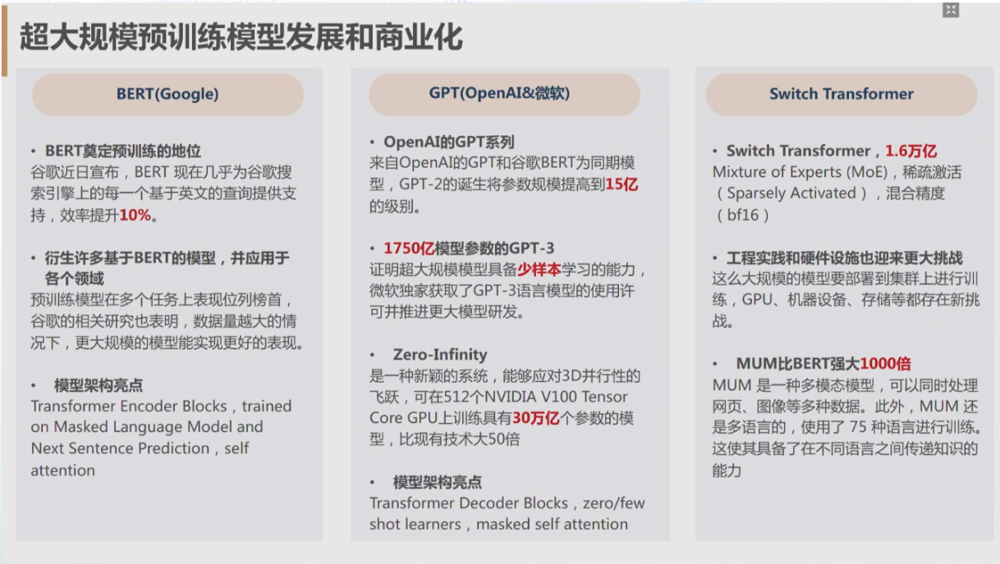

预训练：可以解决搜索里的冷启动问题，此时没有用户行为数据，但有泛内容，比如文字、图片、视频

Green AI

未来大规模模型的基础 MOE

G12， Swtich Transformer gating mechanism 较简单

激活experts的个数和experts的capacity 才是限制

# 文到图生成能力

Dall E 2stage生成

dVAE 

3个核心signals

1.  text2visual
2.  visual
3.  perservation control

# 商业化落地

