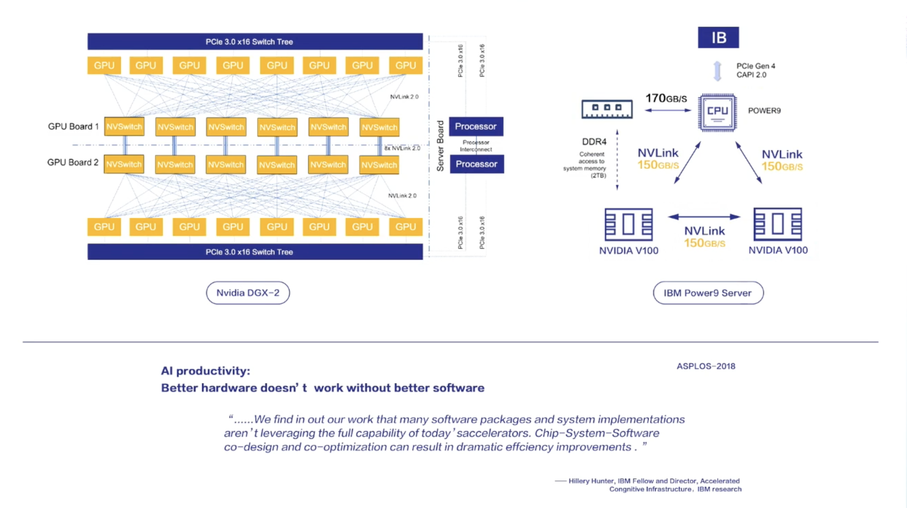

-   related：超算， MPI

case-by-case 并行设计 vs 半自动并行化设计

Scheduler 需要流控，目前没有考虑资源约束，可能导致OOM或死锁

方法： allocator与scheduler对话，进行query， 但会导致抽象泄漏

SBP 类似 GShard 中的annotation

-   Partial操作GShard中没有

# 去中心化系统

-   SubLinear -重计算

