# 

Basics

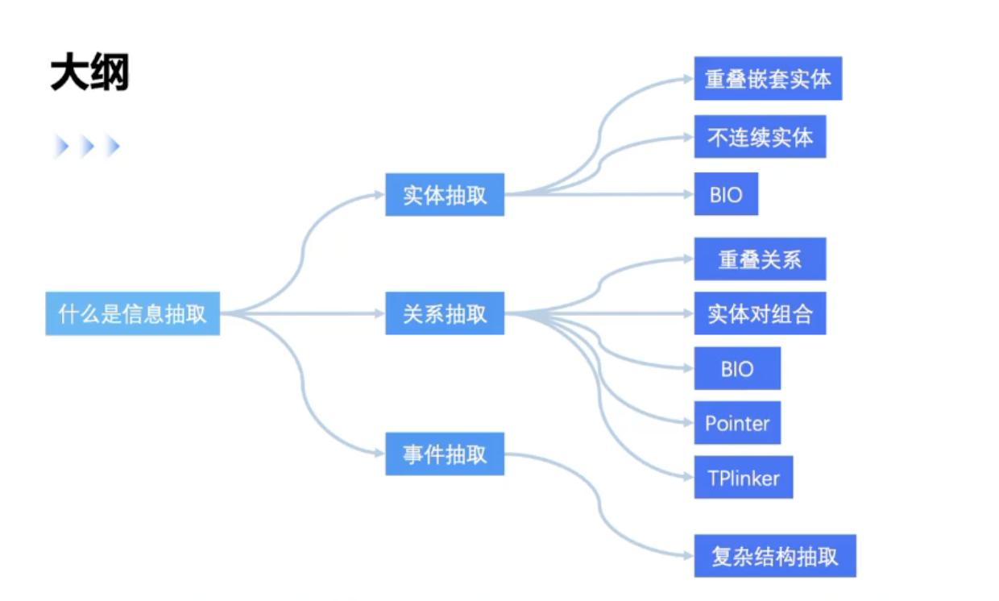

-   例子
    -   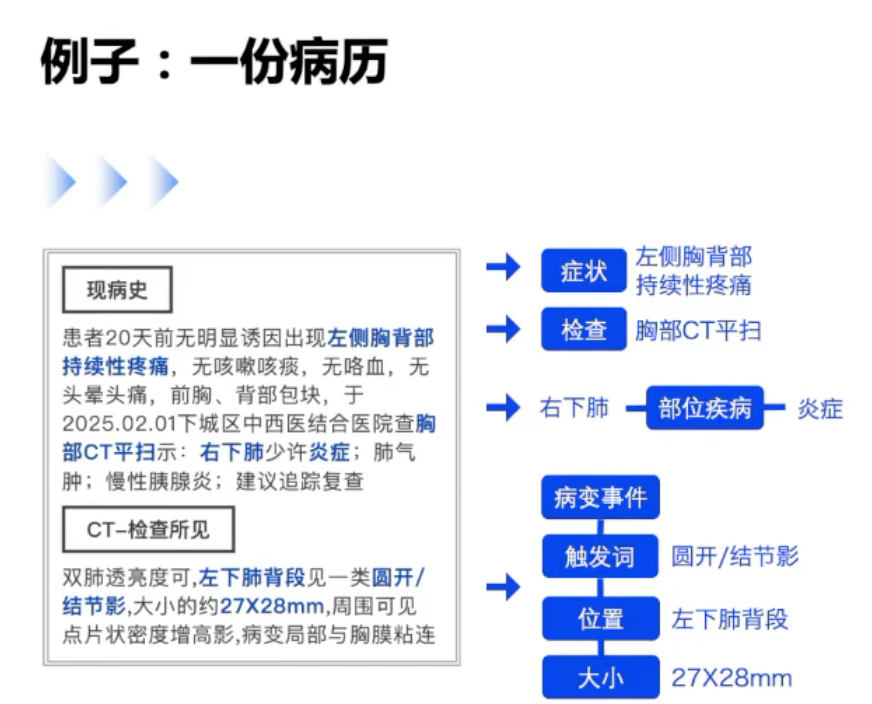
-   Defination
    -   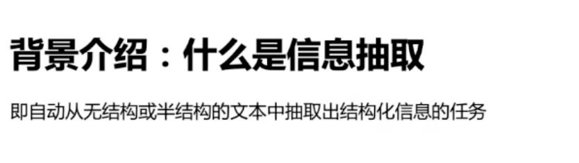
-   抽取式 vs 生成式
    -   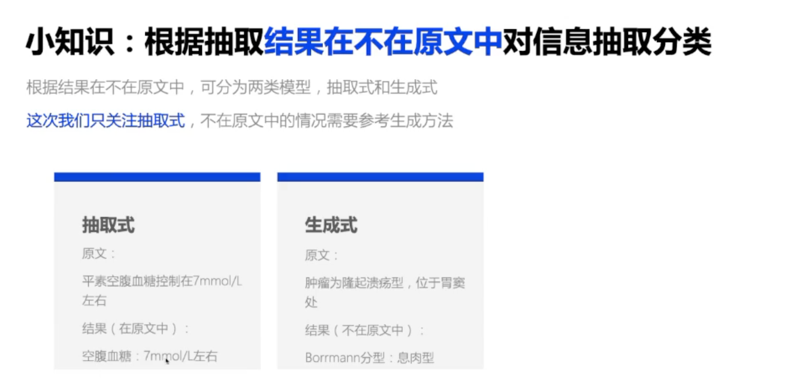

-   分类
    -   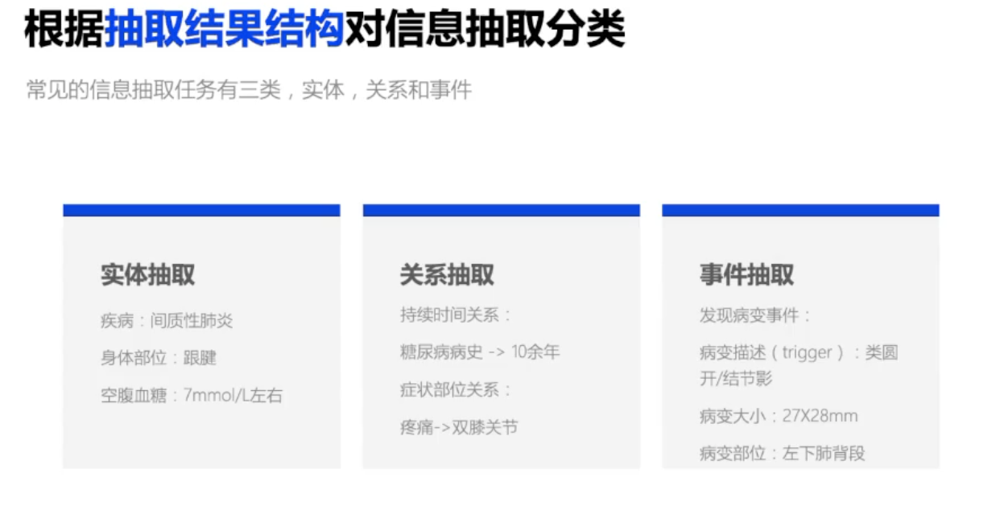

-   评测指标
    -   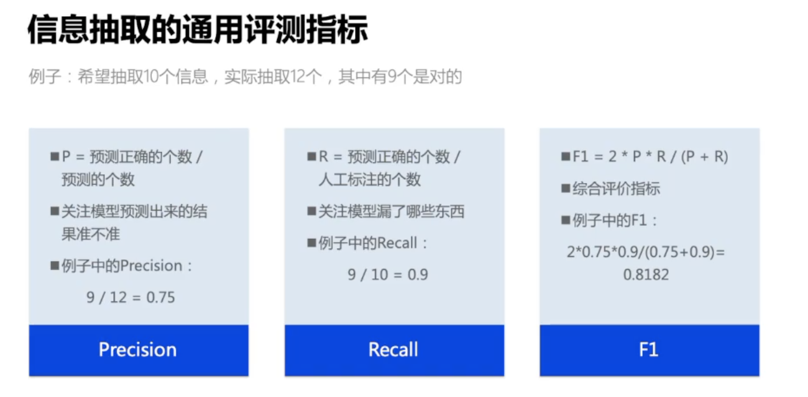

-   核心： 解码设计
    -   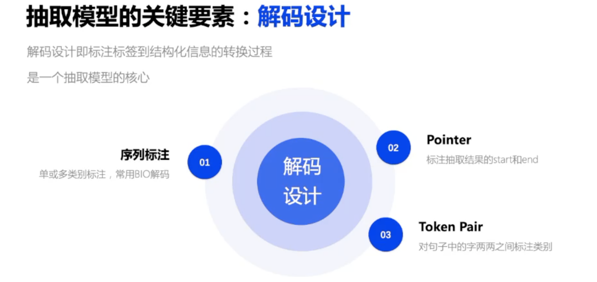

# 实体抽取

-   定义
    -   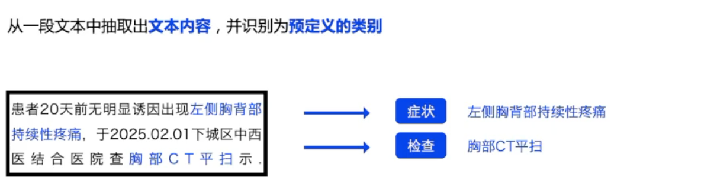

-   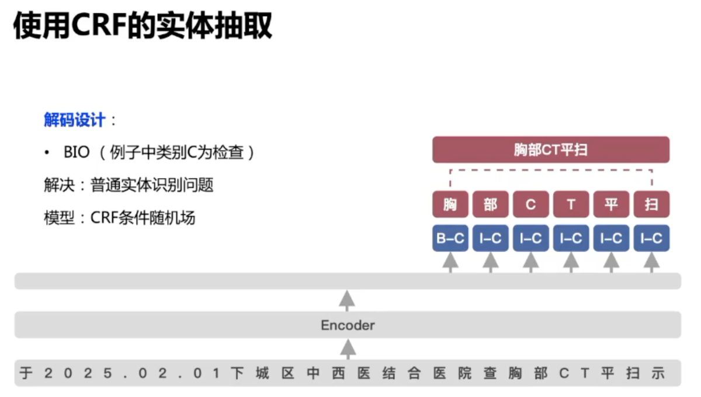

-   问题：

    -   重叠嵌套
        -   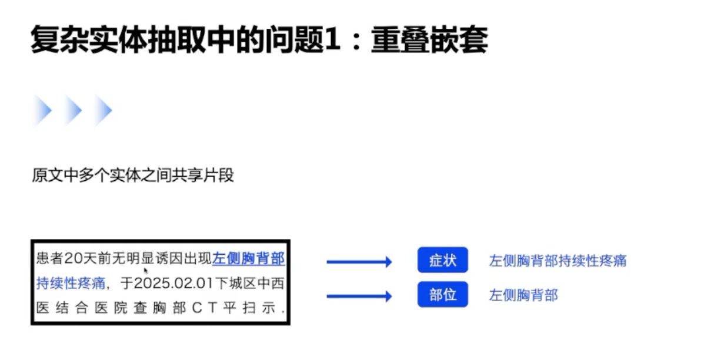

    -   不连续
        -   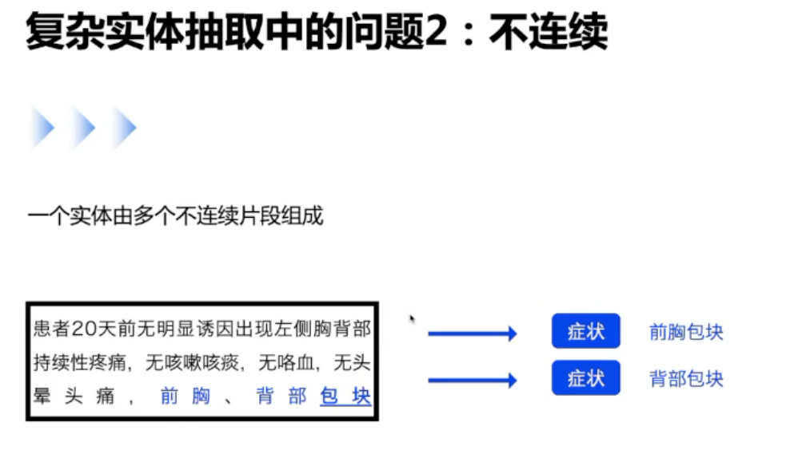

-   解码方式： BIO

# 关系抽取

-   定义
    -   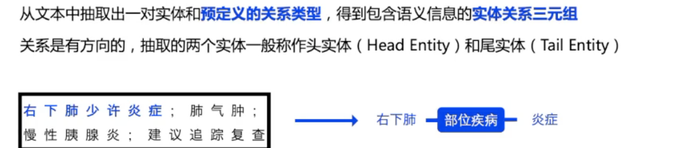

-   一般关系是有方向的

-   两步走：Pipeline vs Joint

    -   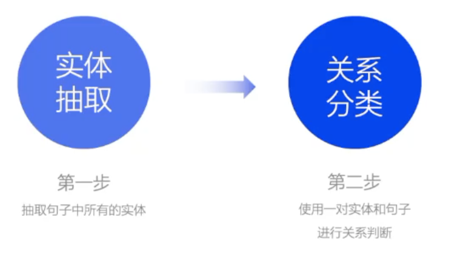
    -   关系分类：
        -   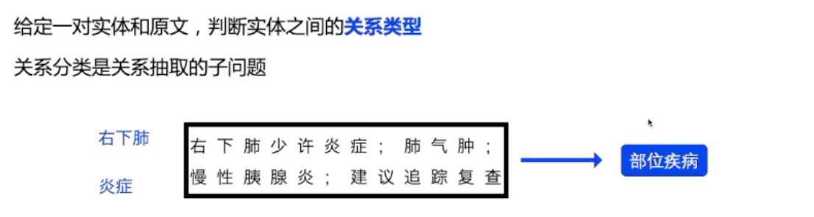

-   (有监督)模型：

    -   使用序列标注BIO：

        -   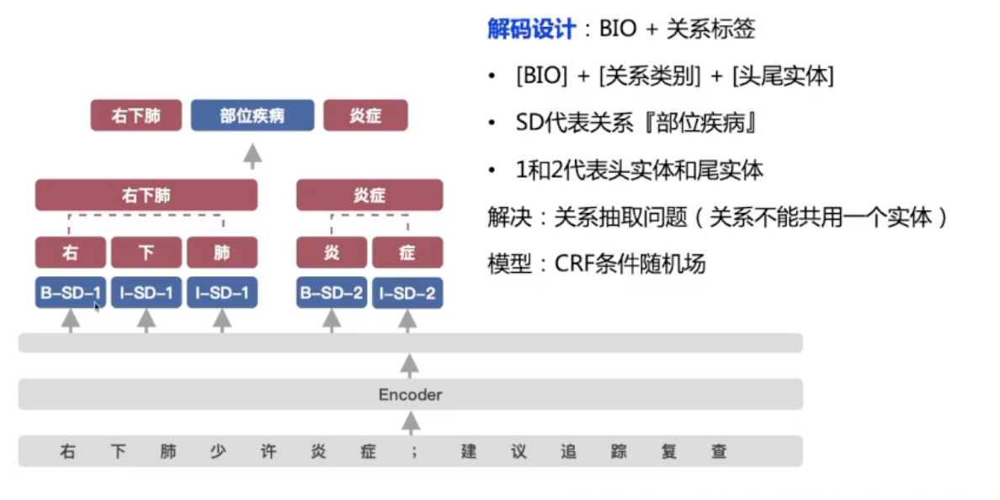

        -   其他没有标注的词全部是O

    -   Sigmoid多分类 -> 重叠关系

        -   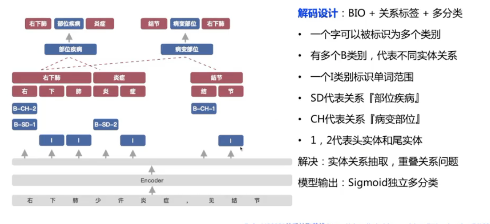

    -   Pointer Network -> 实体对组合

        -   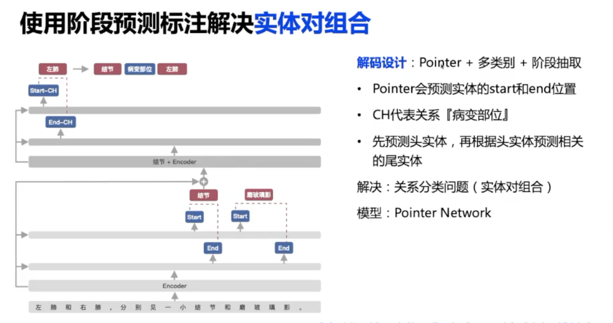

        -   先预测头实体， 然后预测每个头实体对应的尾实体（可能有多个）

    -   TPLinker

        -   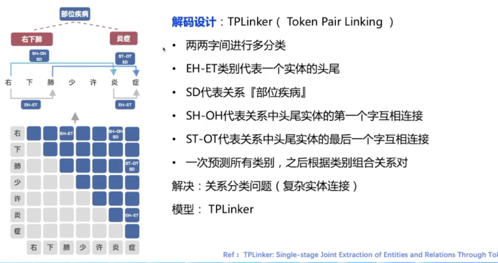

-   关系抽取衍生问题
    -   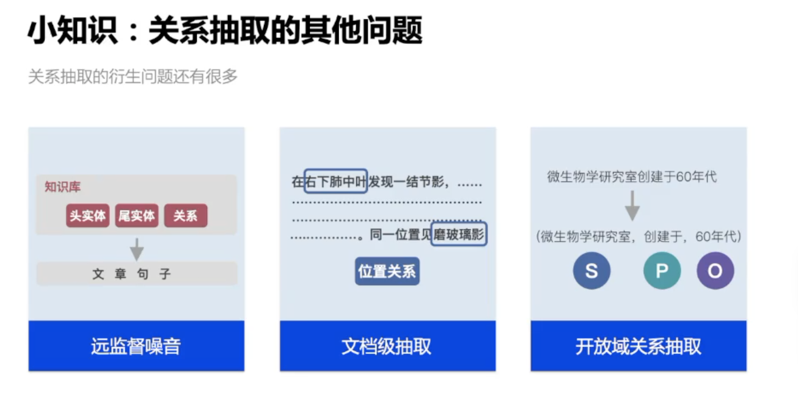

# 事件抽取

-   定义

    -   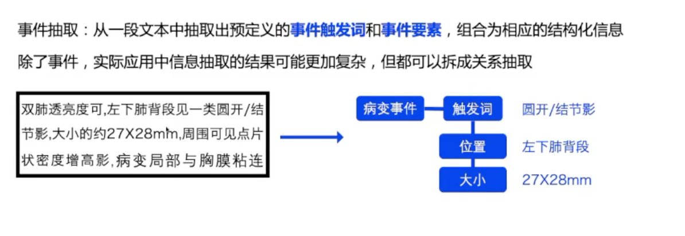

    -   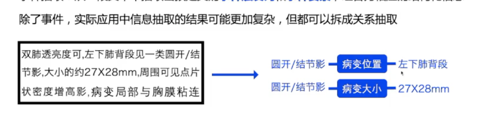

# QA

Sigmoid独立多分类

