# 第一节：NN回顾

# 第二节 自监督词表示学习

-   语言单元表征 

    -   One-hot encoding

    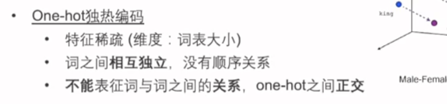

    -   Embedding

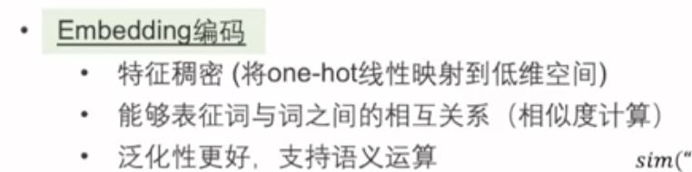

-   词向量模型

    -   Word2Vec

        -   Skip-gram

        -   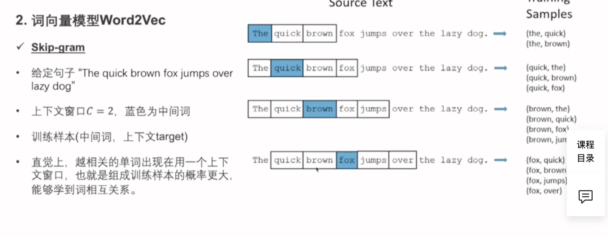

        -   CBoW

            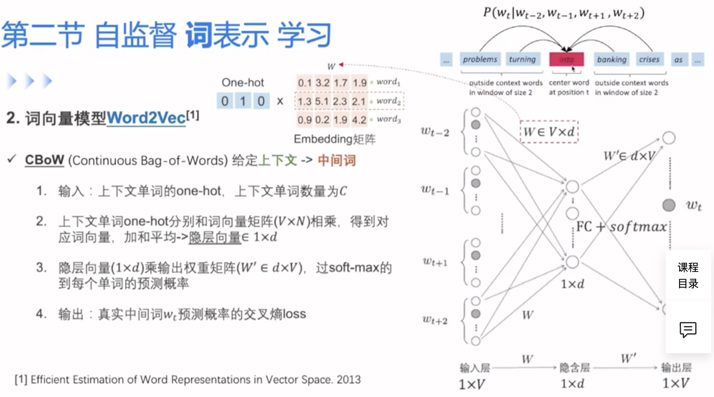

        -   对比：
        -   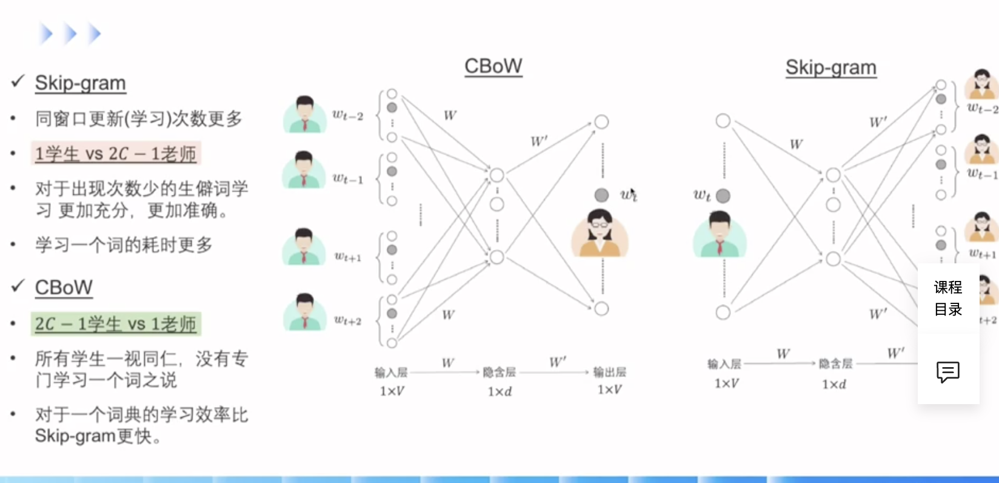

# 第三节： 句子编码神经网络

-   自回归语言模型（LM）
    -   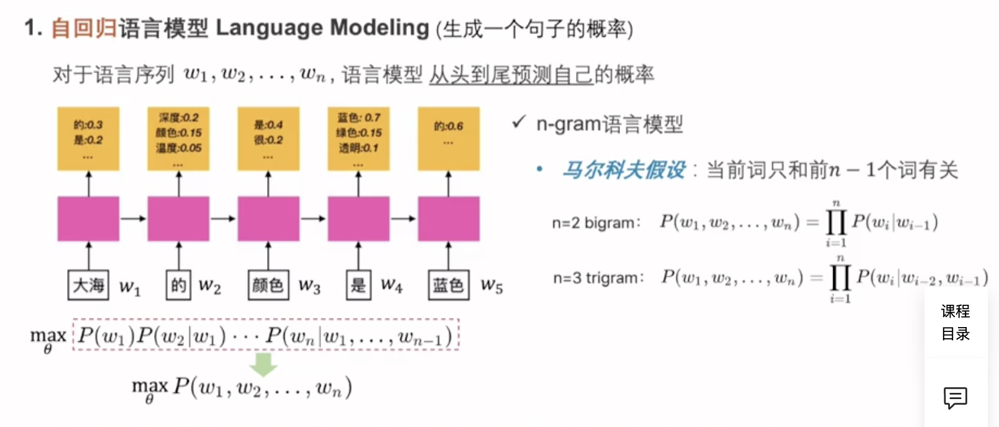

-   RNN：抛开马尔可夫假设

    -   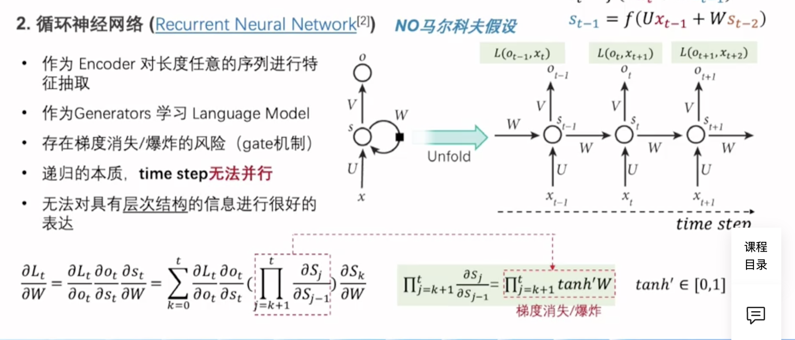

    -   梯度爆炸： 参数项累乘
    -   梯度消失：激活函数项累乘

-   Self-Attention

    -   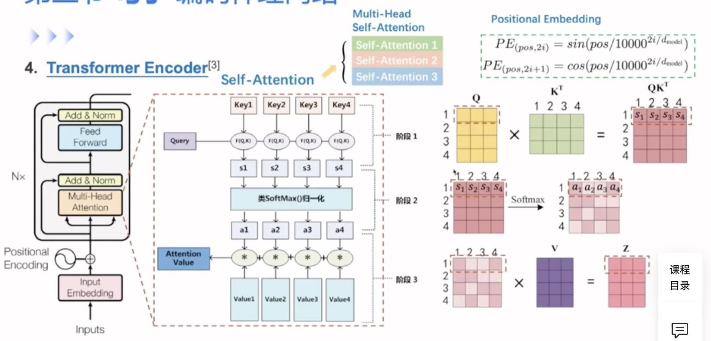

    -   multihead-attention：

        将不同参数的attention重复做多次并拼接到一起。

        目的：让模型参数形成多个子空间， 让模型关注句子信息、语言信息等不同的方面的多视角理解。

    -   残差连接：
        -   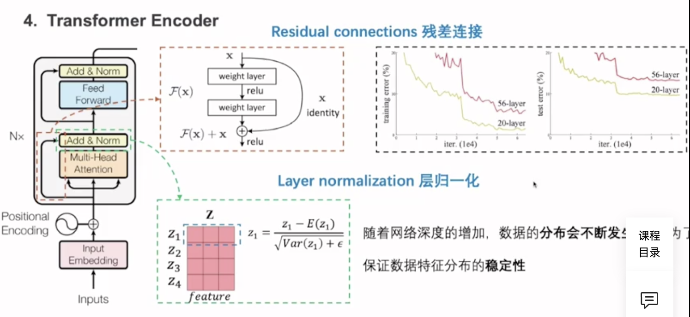

    

    ​			当网络越来越深时会发生梯度消失 -> 残差连接。 包括两部分：**映射部分** + **直连接部分**，

    直连接使得梯度项多了一个常数1， 从而缓解梯度消失问题

    -   层归一化：

        因为前面的残差连接是两个**不同分布**的叠加， 数据的输出分布会不断产生变化 \rightarrow

        对残差结果的输出进行归一化。因为NLP中与CV不同，是变长输入，所以使用层归一化。

    # 第四节： 自回归、自编码预训练学习

    -   自回归LM：GPT
        -   自左至右依次预测句子
        -   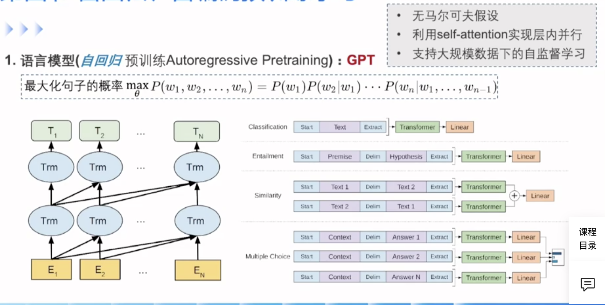

    -   自编码LM：BERT
        -   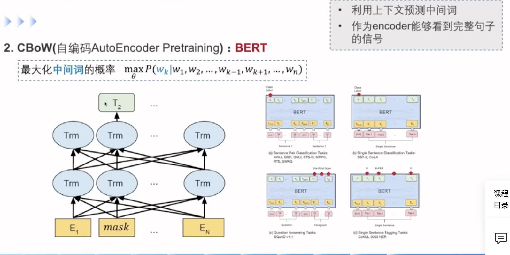
    -   GPT vs BERT：
        -   GPT：只能看到上文
        -   BERT：能看到上下文， 所以句子表示能力更强 

    # QA

    -   中文如何分词：
        -   构建词典： 最大正向匹配或最大负向匹配

    -   为什么不用BN而是用LN？
        -   因为nlp中一个batch里序列长度不同， 使用BN可能将短序列的padding位置也计算进去，造成噪音