# 概念

-   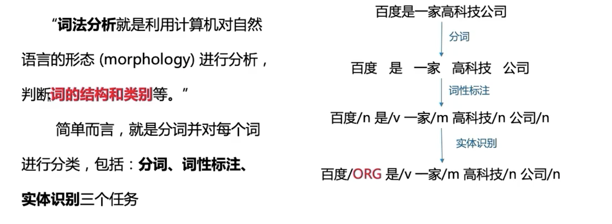
-   三个任务
    -   分词 
    -   词性标注
    -   实体识别 

# 技术发展

-   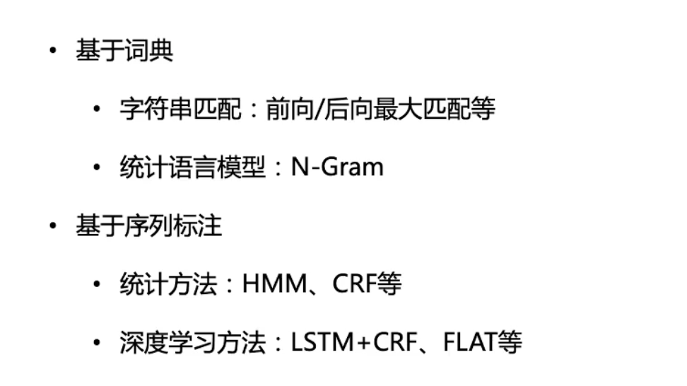

-   分词: 字符串匹配

    -   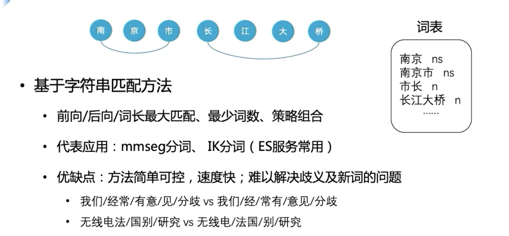
        -   规则匹配，无法处理歧义
        -   基于词表， OOV无法处理

-   统计语言模型

    -   

-   序列标注

    -   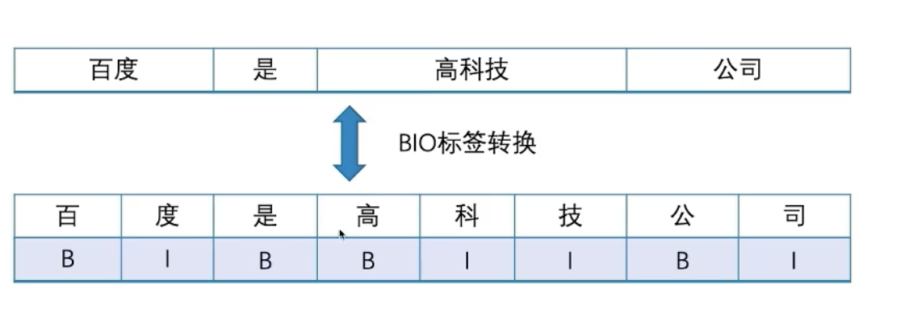

    -   进一步， 加入实体标签

        -   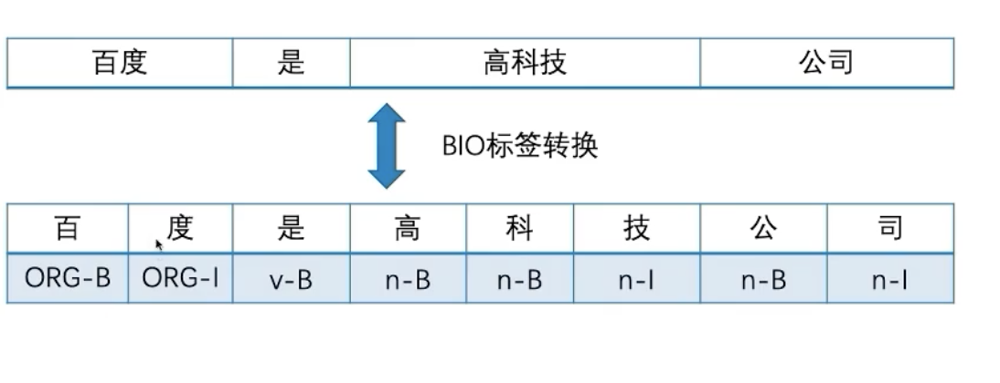
        -   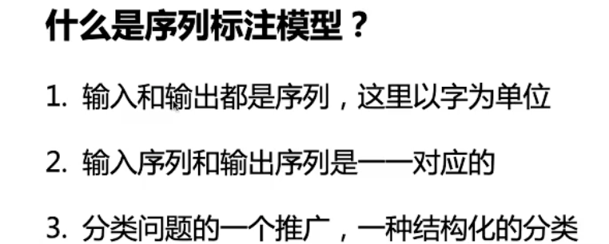
        -   RNN实现
            -   

    -   标签联系CRF：

        -   问题：

        -   

        -   转移矩阵

             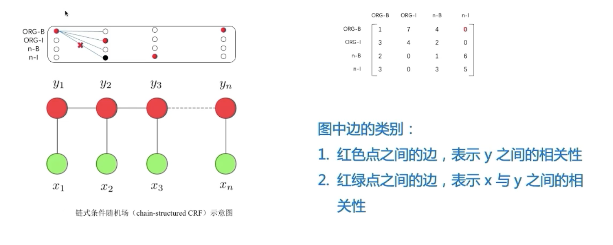

    -   LSTM-CRF

        -   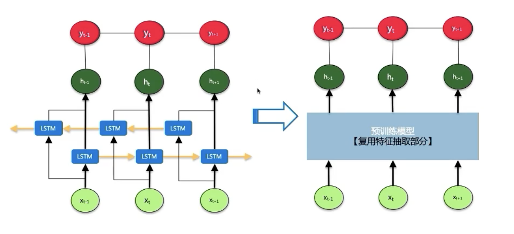
        -   预训练模型-> 缓解OOV问题

-   评估

    -   MSR数据集
        -   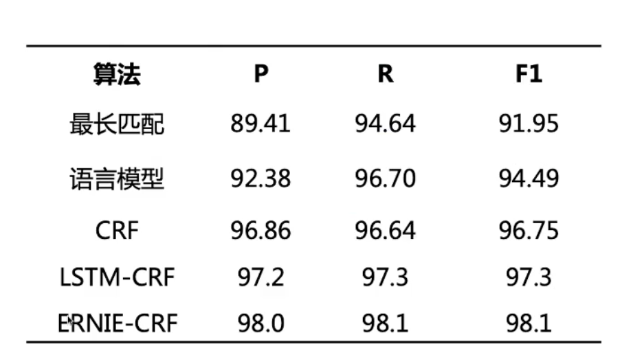
    -   效果评估： 以词为粒度计算
        -   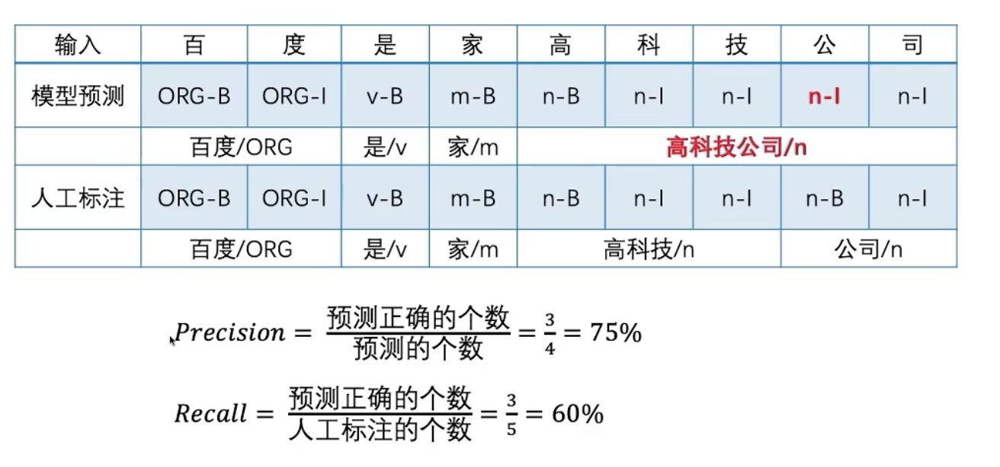

# 以LAC为例，展示词法分析效果及应用

-   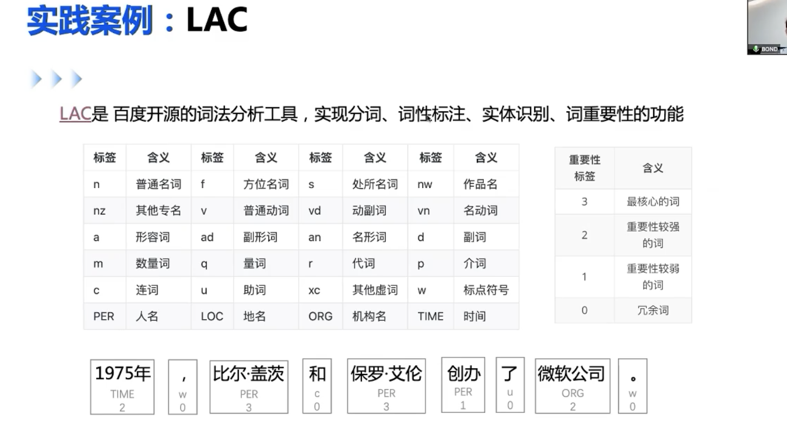

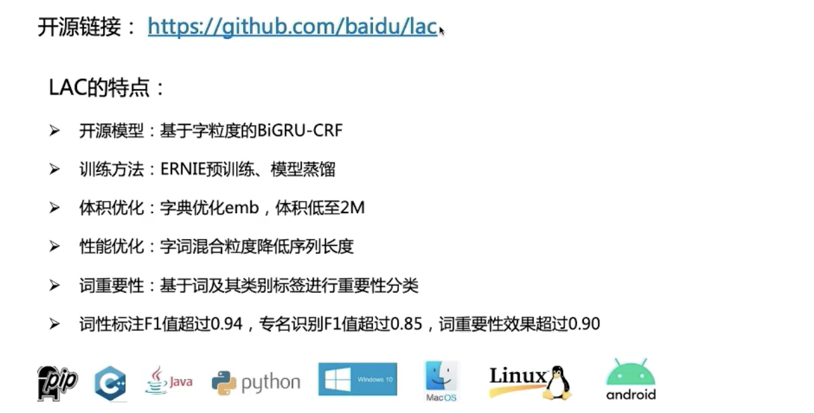