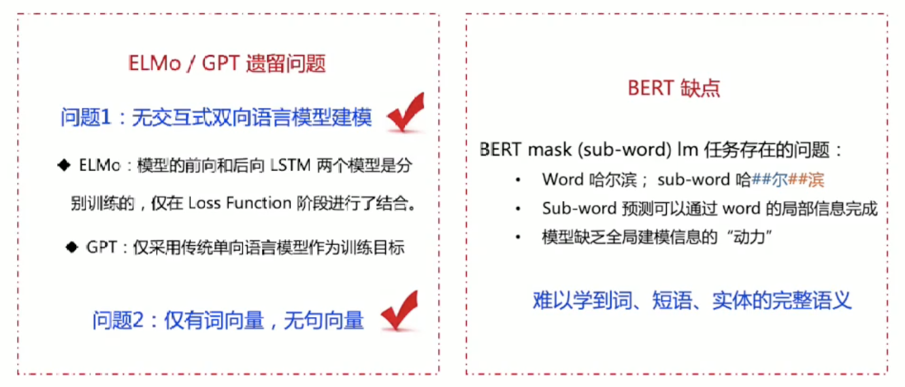

# 语义理解&深度学习

-   什么是语言理解

    

-   如何使用词/文本词向量
    -   

-   问题

    -   

-   解决方案：预训练+微调机制

    -   

    -   

    -   原因：

        

    -   迁移至NLP

        

    

    # 基于预训练的语义理解技术

    

    -   ELMo

        -   

        -   

        -   使用方法：feature-based

            -   $E = a_1E_1 + a_2E_2 + a_3E_3$, $a_1, a_2, a_3$: learnable -> ELMo 是动态可学习的词向量

        -   

        -   解决多义词问题

            

        -   问题：

            

    -   GPT：

        -   
        -   
        -   下游任务使用方式： Model-based
            -   
            -   
        -   缺点：
            -   

    -   BERT

        -   
        -   
        -   使用方式：实验 -> Model-based更优
            -   
            -   
        -   缺点：
            -   

    -   ERNIE

        -   改动： mask-level 从token扩展至词或者短语

        -   

        -   

        -   效果：

            ​	

        -   类似模型：
            -   19.5 Google **BERT-wwm**
            -   19.7 Facebook **SpanBERT**
        -   缺点：
            -   
        -   ERNIE2.0 持续学习
            -   
            -   
            -   
            -   

    -   总结：

        -   

# 预训练模型在NLP经典任务的应用

-   

-   

-   文本匹配

    -   
    -   

    -   两类： 双塔及单塔， 每个塔就是一个transformer encoder

        -   ​	

        -   
        -   

    

    # Final

    

    

